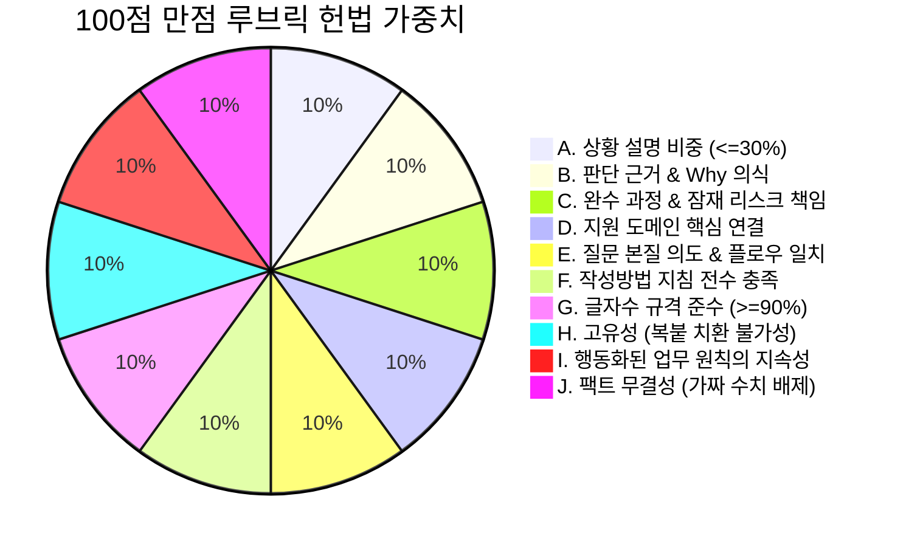

<div align="center">


# 🔥 JasoForge (자소포지)
### 엔터프라이즈급 기술 자기소개서 & 엔지니어링 서사 검증 엔진

[](LICENSE)
[](https://www.python.org/)
[](CHANGELOG.md)
[](scripts/lint.py)

<p align="center">
  <b>마케팅 미사여구 배제. AI 할루시네이션 0%. 100% 결정적 엔지니어링 팩트 검증.</b><br />
  LLM의 칭찬 일색 피상적 초안을 시니어 테크 리드의 독립 블라인드 루브릭으로 단련하여 실전 합격 서사로 탈바꿈합니다.
</p>

[1초 설치](#-1초-원클릭-설치) • [왜 JasoForge인가?](#-왜-jasoforge인가) • [Before vs After](#-before--after) • [10대 루브릭 헌법](#-10대-루브릭-헌법) • [빠른 시작](#-빠른-시작-cli)

</div>

---

## 💡 왜 JasoForge인가?

시중의 일반 AI로 작성된 기술 자기소개서는 현업 시니어 개발자나 테크 리드의 서류 검토 단계에서 즉시 기각됩니다:

* **미사여구의 덫 (The Fluff Trap)**: *"열정적인 태도로 원활히 소통하여 최고의 성과를 냈습니다"* 같은 진부한 형용사가 기술적 밑바닥 구현의 부재를 감추지 못합니다.
* **AI의 '칭찬 폭탄' 편향**: 일반 LLM은 피평가자에게 아첨하도록 미세조정되어 있어, 실제 서류 전형에서 100% 탈락할 피상적인 글에도 95점 이상의 가짜 점수를 부여합니다.
* **도메인 미스매치**: 대용량 트랜잭션, 메모리 관리, 멱등성 등 실제 기업 시스템의 엣지케이스와 무관한 단순 학술 토이 프로젝트의 API 호출 나열에 그칩니다.

**JasoForge는 이를 시스템적으로 해결합니다.** 엄격한 컴파일러 패스(Compiler Pass)와 린터의 원리를 자기소개서 검증에 도입했습니다:

1. **결정적 기계 린트 (`lint.py`)**: 글자수 경계 검사(상한선 90% 이상), 작성방법 세부 지침 키워드 전수 충족도, 블라인드 위반 단어 검출, 문장 길이 분포 및 리듬 검사.
2. **컨텍스트 격리 듀얼 블라인드 채점 (`grade.py`)**: 인사담당자(작성방법 준수, 글자수, 서사 지속성)와 현업 테크 리드(Why 의식, 버린 대안, 밑바닥 레이어 규명 grit, 시스템 조망력)를 독립 서브에이전트로 분리 채점.
3. **회귀 방지 점수 원장**: 버전 수정 과정($V_1 \rightarrow V_2$)에서 점수가 진동하거나 이전 강점이 퇴행하는 현상을 수학적으로 방지.

---

## ⚡ 1초 원클릭 설치

JasoForge는 **Claude Code**, **Gemini CLI / Antigravity**, **Universal Agents** 환경을 스마트하게 감지하여 배포됩니다. 미설치된 런타임의 폴더를 임의로 생성하지 않습니다.

### macOS & Linux
```bash
curl -fsSL https://raw.githubusercontent.com/choosla/jasoforge/main/install.sh | bash
```

### Windows (PowerShell 5.1+ 또는 7+)
```powershell
irm https://raw.githubusercontent.com/choosla/jasoforge/main/install.ps1 | iex
```

### Python 범용 CLI (무의존성 단독 설치)
```bash
git clone https://github.com/choosla/jasoforge.git
cd jasoforge
python3 installer.py
```

> **스마트 런타임 감지 지원 경로**:
> - `Universal Agents`: `~/.agents/skills/jaso-pipeline`
> - `Claude Code`: `~/.claude/skills/jaso-pipeline` (Claude 환경 감지 시)
> - `Gemini / AGY`: `~/.gemini/config/skills/jaso-pipeline` (Gemini 환경 감지 시)

---

## 📊 Before & After

| 평가 기준 | 일반 AI 생성 자기소개서 | 🔥 JasoForge 단련 서사 |
| :--- | :--- | :--- |
| **피드백 태도** | 온정주의, 무조건적인 칭찬 ("훌륭한 초안입니다! 95점") | 냉철한 시니어 테크 리드 시점의 감점 요인 직격 |
| **글자수 준수** | 대략적인 글자수 환각 (700자 요청 시 550자나 820자 작성) | 바이트/글자수 단위 결정적 상하한선 준수 ($\ge 90\%$) |
| **작성 지침 충족** | 복합 문항 지시사항 일부 누락 | 지시문 내 모든 조건의 키워드 충족도 0건 시 즉시 FAIL |
| **기술적 깊이** | 단순 프레임워크/라이브러리 사용 나열 | 밑바닥 레이어 원인 규명, 버린 대안 및 트레이드오프 서술 |
| **면접 방어력** | 면접관의 기술 압박 질문에 방어 논리 붕괴 | **킬러 꼬리질문(압박 질문)** 및 추천 방어 논리 자동 도출 |
| **시스템성** | 감에 의존한 프롬프트 재수정 | 린트 $\rightarrow$ 블라인드 채점 $\rightarrow$ 점수 원장 기록 $\rightarrow$ 회귀 방지 |

---

## 📜 10대 루브릭 헌법

모든 엔지니어링 서사는 10개 평가 축(축당 10점, 100점 만점)을 기준으로 엄격하게 채점됩니다:



| 축 | 핵심 원칙 | 엄격 감점 기준 |
| :---: | :--- | :--- |
| **A** | **상황 설명 비중 $\le 30\%$** | 배경/상황 설명이 글자수의 30%를 초과하거나 단순 기능 나열 시 감점 |
| **B** | **판단 근거 & Why 의식** | 원리 규명 없는 단순 API 적용, 버린 대안(트레이드오프) 부재 시 감점 |
| **C** | **완수 과정 & 리스크 책임** | 잠재 리스크를 확인하지 않고 기능 구현 선에서 중단한 경우 감점 |
| **D** | **지원 도메인 핵심 연결** | 지원 도메인의 핵심 시스템 및 엣지케이스와 무관한 단순 과제 서술 시 감점 |
| **E** | **질문 본질 의도 & 플로우 일치** | 문항의 평가 의도 미관통, 지시문의 서술 순서 인과관계 불일치 시 감점 |
| **F** | **작성방법 지침 전수 충족** | 지시문 필수 항목(구체적 행동, 결과, 보완 노력, 계기 등) 누락 시 감점 |
| **G** | **글자수 규격 준수** | 상한 글자수 대비 충실도가 90% 미만인 경우 감점 |
| **H** | **고유성 (치환 불가성)** | 고유명사 제거 시 타사/타직무 어디에나 복붙 가능한 일반론 문장 시 감점 |
| **I** | **행동화된 가치관 지속성** | 추상적인 형용사("성실함") 나열, 입사 후 업무 지속성이 안 보일 때 감점 |
| **J** | **팩트 무결성 & 비문 배제** | 검증되지 않은 가짜 수치(0ms 등)나 왜곡된 사실, 오탈자/비문 존재 시 감점 |

---

## 🛠️ 빠른 시작 (CLI)

JasoForge는 외부 종속성 없이 로컬 텍스트 및 JSON 파일만으로 완결 구동됩니다:

### 1. 결정적 기계 린트 (Deterministic Lint)
```bash
python3 scripts/lint.py draft.txt spec.json
```
*글자수 도달율, 작성방법 키워드 충족도, 블라인드 위반 여부, 문장 리듬 검사.*

### 2. 컨텍스트 격리 독립 블라인드 채점 (Dual-Track Grade)
```bash
python3 scripts/grade.py draft.txt \
  --spec spec.json \
  --context context.json \
  --rubric references/rubric_tech.json \
  --output report.json
```
*인사 및 현업 테크 리드 독립 평가, 감점 요인 및 본문 인용문 추출, 킬러 면접 꼬리질문 및 방어 논리 도출.*

### 3. 엔드투엔드 파이프라인 통합 실행
```bash
python3 scripts/run_pipeline.py \
  --draft draft.txt \
  --spec spec.json \
  --context context.json
```

---

## 🤝 라이선스 (License)

이 프로젝트는 **[MIT License](LICENSE)** 하에 배포됩니다.
오픈소스 생태계와 개발자 커뮤니티의 합격 서사 단련을 위해 자유롭게 사용하고 기여하실 수 있습니다.
