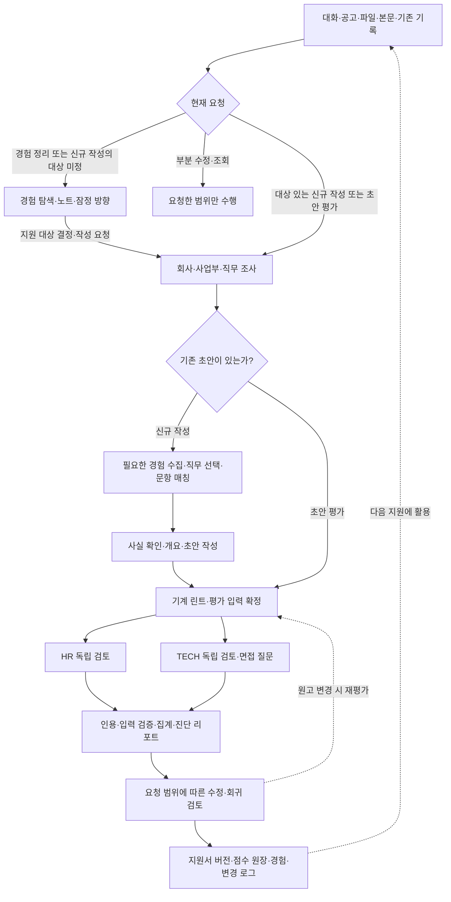

<div align="center">


# JasoForge

### Engineering Narrative & Resume Review Pipeline

[](LICENSE)
[](https://www.python.org/)
[](CHANGELOG.md)
[](SKILL.md)

**경험을 벼리고, 근거로 설득하다.**

공고 속 요구를 읽고, 경험 속 판단을 꺼내고, 독립된 두 시선으로 원고를 단련합니다.<br />
조사부터 작성·검증·기록까지 이어지는 자기소개서 파이프라인.

[왜 JasoForge인가?](#why) · [빠른 사용법](#quick-start) · [핵심 아키텍처](#architecture) · [작성과 검토 기준](#rubric) · [설치](#install) · [CLI](#cli)

</div>

---

<a id="why"></a>

## 🔥 왜 JasoForge인가?

밤새 다듬은 자기소개서에 AI는 높은 점수를 줍니다. 그런데 다시 읽어보면 정작 중요한 설명이 빠져 있습니다. 그 선택을 한 이유, 팀 안에서 내가 맡은 일, 이 회사의 업무와 경험이 만나는 지점. **매끈한 문장 사이에 남은 빈칸이 설득력을 가릅니다.**

JasoForge는 공고의 요구를 읽고, 사용자의 이야기와 자료에서 경험 속 판단을 끌어냅니다. 아직 정리된 기록이 없어도 대화로 소재를 구체화합니다. 무엇을 쓸지 고르는 순간부터, 쓴 내용을 다른 시선으로 읽고 다음 지원에 남기는 순간까지 하나의 작업으로 연결합니다.

### 1. 좋은 소재는 질문을 만났을 때 힘을 얻습니다

같은 경험에서도 지원동기는 관심이 생긴 이유를, 역량 문항은 판단과 실행을, 협업 문항은 서로의 필요를 맞춘 과정을 끌어냅니다. 회사·사업부·직무와 문항의 의도를 살피고, 사용자가 들려준 경험이나 기존 자료에서 **이번 질문에 답할 수 있는 장면**을 찾습니다. 정리된 기록이 없어도 필요한 질문을 주고받으며 소재를 구체화합니다.

### 2. 쓴 사람의 확신을 넘어, 읽는 사람의 근거로

HR와 TECH가 작성 대화를 물려받지 않은 별도 컨텍스트에서 원고를 검토합니다. 문항에 답했는지, 판단의 이유가 보이는지, 주장에 근거가 있는지를 읽고 **본문의 실제 문장을 인용해** 평가를 설명합니다. Python은 글자 수·입력 해시·인용 일치·집계를 확인합니다.

### 3. 한 번의 지원이 다음 지원의 자산이 되도록

수정하며 새로 확인한 경험, 원고를 바꾼 이유, 버전별 평가를 기록합니다. 다음 공고를 만났을 때는 그 기록에서 다시 출발합니다. **지원할수록 자신의 경험을 더 정확히 설명할 수 있는 작업 공간**을 만듭니다.

---

<a id="quick-start"></a>

## 🚀 빠른 사용법

스킬을 설치한 뒤 원하는 작업을 말하세요. 공고·초안·메모가 있으면 함께 주고, 아직 아무것도 정리하지 않았다면 대화로 시작하면 됩니다. 에이전트가 필요한 질문과 자료 정리, 도구 실행을 이어갑니다.

| 가지고 있는 자료 | 시작하는 방식 |
| :--- | :--- |
| **정리한 자료 없음** | 해본 일과 관심 분야를 이야기하며 소재 탐색 |
| **공고 링크** | 실제 문항·분량 조건을 확인하고 회사·사업부·직무 조사 |
| **Notion 링크** | 페이지 본문과 연결된 지원서·조사·경험 아카이브 조회 |
| **로컬 파일** | PDF·TXT·MD·DOCX를 읽고 공고·초안·경험·가이드 구분 |
| **붙여넣은 본문** | 제공한 공고·문항·원고에서 바로 작업 시작 |
| **회사·팀명** | 현재 요청과 기존 맥락에서 대상 법인·직무 확인, 신규 작성이면 필요한 경험 탐색 |

**이야기에서 첫 기록으로**

```text
자소서가 처음이고 정리해 둔 자료는 없어. 경험부터 같이 찾아줘.
아직 지원할 회사는 못 정했어. 내가 해본 일부터 정리해줘.
```

수업·아르바이트·동아리·개인 활동 등 실제로 해본 일에서 출발합니다. 답변에 따라 필요한 부분을 구체화하고, 문항에 답할 만큼 소재를 이해하면 초안을 씁니다. 수치나 기억이 없으면 지어내지 않고 확인 가능한 범위로 정리합니다. 지원 대상이 아직 없으면 경험 노트부터 남겨 다음 지원에 연결합니다.

**공고에서 원고까지**

```text
이 공고로 자소서 파이프라인 끝까지 진행해줘. 기록은 없으니 필요한 경험은 질문해줘. [링크]
```

공고 조사 → 경험 탐색·매칭 → 초안 작성 → 독립 평가 → 수정·기록으로 이어집니다. 이미 정리한 이력서나 경험 아카이브가 있으면 읽고 이어서 작업합니다. 직무가 미정이면 관심·경험과 공고의 직무를 비교해 선택부터 돕습니다.

**이미 쓴 글을 더 깊이 읽기**

```text
이 자소서 평가해줘. [링크 / 파일 경로 / 본문]
```

기존 초안을 기준으로 조사·규격 검사·독립 평가를 진행합니다. 문항별 근거, 보완 지점, 면접에서 확인할 질문까지 진단 리포트로 받습니다.

**지금 필요한 만큼 요청하기**

```text
이 공고를 보고 내 경험으로 1번 문항 써줘. [공고]
이 문장만 자연스럽게 고쳐줘. [문장]
이 버전을 노션 지원서 아카이브와 변경 로그에 반영해줘. [버전]
```

요청한 문항이나 문장에 범위를 맞춥니다. 전체 작성·평가부터 부분 수정까지 같은 스킬에서 이어갈 수 있습니다.

<details>
<summary><b>작업 모드와 교차 평가</b></summary>

- `--local`: Notion 없이 로컬에서 작성·평가·기록합니다. 필요한 공개 공고·회사 조사는 가능합니다.
- `--offline`: 네트워크 조회 없이 제공된 자료로 진행합니다.
- `--sync-notion` / `--notion`: 요청한 작업을 기존 Notion 자료와 연결해 반영합니다.
- `--quick`: 제공 자료로 빠르게 검토하고, 생략한 조사·평가 범위를 알려줍니다.

작성과 검토에 서로 다른 모델을 사용해 판단 근거를 비교할 수도 있습니다. 새 컨텍스트에서도 같은 모델의 문체 선호가 남을 수 있으며, 모델을 바꾸는 것만으로 객관성이 보장되지는 않습니다.

</details>

---

<a id="architecture"></a>

## 🏛️ 핵심 아키텍처

**조사로 방향을 잡고, 작성으로 연결하고, 검토와 기록으로 다듬습니다.**



AI 에이전트는 경험을 듣는 대화·조사·글쓰기·독립 검토·내용 수정을 맡습니다. Python 엔진은 명시된 분량과 블라인드 규정, 입력 동일성, 인용 일치와 점수 집계를 확인합니다. 전체 작성·평가의 흐름이며 한 문항 작성이나 부분 수정은 요청한 범위까지 수행합니다. 실제로 수행한 단계와 남은 확인 사항을 함께 보고합니다.

### ✍️ 문항마다 설득의 흐름이 있습니다

회사별 컨설팅의 가이드와 사례에서 도출한 [문항별 작성 흐름](references/question-flows.md)을 소재 선택부터 작성·평가까지 연결합니다. 각 항목을 채웠는지와 **앞의 경험이 왜 다음 선택으로 이어지는지**를 함께 살핍니다.

| 문항 | 글에서 드러낼 연결 |
| :--- | :--- |
| **지원동기** | 경험에서 생긴 관심과 회사·직무를 선택한 이유 |
| **직무 역량** | 필요한 능력과 이를 보여주는 본인의 판단·실행 |
| **협업** | 상대의 필요를 이해한 과정과 함께 바꾼 행동 |
| **가치관·성장과정** | 영향을 준 경험과 이후 선택에 남은 변화 |
| **AI 활용** | 도구의 활용과 본인의 검증·판단·보완 |
| **사회·산업 이슈** | 확인한 사실과 그에 대한 자신의 견해·논거 |

관심과 노력, 프로젝트 완수, 끈기, 자발적 도움, 제품 경험을 포함해 12가지 유형을 다룹니다. 실제 문항과 경험에 맞춰 전개하며, 예시의 순서나 문장 수를 점수 조건으로 삼지 않습니다.

<a id="rubric"></a>

## 📐 작성과 검토 기준 — 점수마다 근거를 남깁니다

HR는 질문과 설명의 전달력을, TECH는 판단과 주장의 근거를 읽습니다. 문항별로 적용할 축과 이유를 정한 뒤 각자 검토합니다.

| 축 | 검토 항목 | 담당 | 핵심 질문 |
| :---: | :--- | :---: | :--- |
| **A** | 맥락과 본인의 판단·행동 | HR | 어떤 상황에서 무엇을 맡고 행동했는가? |
| **B** | 판단의 근거 | TECH | 왜 그 선택을 했으며 무엇을 근거로 삼았는가? |
| **C** | 수행 범위와 결과 | TECH | 본인이 한 일과 확인된 결과의 범위가 분명한가? |
| **D** | 직무 관련성 | TECH | 질문이 요구한 업무와 경험의 접점이 설명되는가? |
| **E** | 문항 요구와 설명의 연결 | HR | 질문에 답하며 설명을 따라갈 수 있는가? |
| **F** | 명시된 필수 항목 | HR | 공고·문항이 요청한 내용을 충족했는가? |
| **H** | 경험·관점의 구체성 | TECH | 본인의 상황과 선택을 구체적으로 이해할 수 있는가? |
| **I** | 가치관·태도의 근거 | HR | 문항이 요구한 태도가 행동에 드러나는가? |

작성의 8개 축은 1~5점으로 평가하고, 문항에서 요구하지 않는 축은 이유와 함께 N/A로 남깁니다. **글의 설명력, 제출 규격, 사실 대조를 한 점수로 섞지 않습니다.**

| 결과 | 살펴보는 것 | 표시 |
| :--- | :--- | :--- |
| 작성 점수 | 질문에 대한 답과 판단·행동·결과의 연결 | 점수와 본문 근거 |
| 규격 검사 | 실제 분량·형식·블라인드 조건 | 충족·위반·미확인 |
| 선택적 근거 대조 | 제공한 경험 기록과 주요 주장의 관계 | 일치·미확인·불일치와 영향 |

경험 원장 없이 시작해도 됩니다. 사용자의 설명으로 작성·평가하고, 인터뷰 답변과 수정 이력을 다음 지원에서 재사용합니다. 기록을 제공하면 그 범위에서 추가 대조하며, 자료가 없다는 이유로 감점하지 않습니다. 핵심 역할·성과의 충돌은 높은 점수에 가리지 않고 먼저 표시합니다.

문항 원문·직무 설명 부족으로 평가가 불가능하면 해당 축을 유보하고 문항·종합 점수를 확정하지 않습니다. 점수는 합격 확률이 아니며, v4의 규격·사실 대조를 포함한 지수와 직접 비교하지 않습니다.

최종 리포트는 **종합 판단 → 규격 검사 → 문항별 HR/TECH 근거 → 면접 확인 질문 → 보완·다음 행동**으로 구성됩니다. 원고의 어느 부분을 왜 바꿔야 하는지, 면접에서 어디까지 설명할 수 있는지를 함께 확인합니다.

---

<a id="install"></a>

## ⚡ 설치

Python 3.9 이상을 사용합니다. Python 엔진과 설치기는 표준 라이브러리로 동작합니다.

받은 소스나 배포 ZIP의 폴더에서 설치할 수 있습니다.

```sh
python3 installer.py --dry-run
python3 installer.py
```

설치기는 기존 대상 폴더를 교체합니다. 그 안에 보관한 작업 자료나 직접 수정한 파일은 먼저 별도로 보존하세요. `--target agents`, `claude`, `gemini`, `all`로 대상을 지정하고, `--symlink`로 소스 폴더를 연결할 수 있습니다.

<details>
<summary><b>GitHub 공개 버전 설치</b></summary>

아래 명령은 GitHub에 게시된 버전을 설치합니다. 로컬 수정본은 받은 폴더에서 위의 Python 설치 명령을 사용하세요.

**skills.sh**

```sh
npx skills add choosla/jasoforge
```

**macOS · Linux**

```sh
curl -fsSL https://raw.githubusercontent.com/choosla/jasoforge/main/install.sh | bash
```

**Windows · PowerShell**

```powershell
irm https://raw.githubusercontent.com/choosla/jasoforge/main/install.ps1 | iex
```

</details>

### 🖥️ 실행 환경

| 환경 | 스킬 위치 | 설치 방식 |
| :--- | :--- | :--- |
| **Universal Agents** | `~/.agents/skills/jaso-pipeline` | `--target agents` |
| **Claude Code** | `~/.claude/skills/jaso-pipeline` | `--target claude` |
| **Gemini CLI / Antigravity** | `~/.gemini/config/skills/jaso-pipeline` | `--target gemini` |
| **OpenAI Codex** | `~/.codex/skills/jaso-pipeline` | 해당 경로에 폴더 배치 |

런타임에서 `SKILL.md`를 선택하거나 연결해 실행합니다. 파일 읽기·자료 조회·Python 실행·독립 평가자 호출은 호스트 도구를 사용하며, Notion 연동에는 연결된 Notion 도구가 필요합니다. 도구가 없는 단계는 미실행 범위와 재개에 필요한 자료를 남깁니다. 현재 Python 설치기는 Codex 전용 대상 옵션을 제공하지 않습니다.

---

<a id="cli"></a>

## 🛠️ 개발·검증용 CLI

도구를 직접 점검할 때 사용하는 명령입니다. 일반 사용에서는 에이전트가 실제 공고와 원고를 읽어 필요한 파일을 준비합니다.

```sh
# 원고 규격 검사
python3 scripts/lint.py draft.txt spec.json

# 독립 평가용 패킷 생성
python3 scripts/run_pipeline.py draft.txt spec.json --context context.json

# 기존 동작 테스트
python3 -m unittest discover -s scripts -p 'test_*.py'

# Python·JSON 구문과 SKILL 참조 검사
python3 scripts/verify_lossless.py
```

패킷 생성 이후에는 호스트 에이전트가 HR·TECH를 호출하고 결과를 집계합니다. 상세 절차와 가중치 프리셋은 [평가 실행 계약](references/evaluation.md), 점수 원장·버전·경험 기록은 [저장 계약](references/workflow-storage.md)에 있습니다. 구형 입력과 기록은 [이전 안내](references/migration.md)를 따릅니다. `verify_lossless.py`는 정적 검사이며 전체 동작 검증은 위의 테스트와 실제 실행으로 확인합니다.

## 🤝 기여와 라이선스

JasoForge는 [MIT License](LICENSE)로 배포됩니다. 변경 전에는 [기능 보존 지침](GUIDELINES.md)을 읽고, 실제 요청이 조사부터 최종 기록까지 이어지는지 확인해 주세요.

**한 사람의 경험이 제대로 읽히도록. 그 경험이 다음 기회에서도 힘을 발휘하도록.**

[전체 실행 지침](SKILL.md) · [변경 기록](CHANGELOG.md) · [Notion 연결](references/notion_schema.md)
