# 🏢 자소서 완결형 E2E 파이프라인 규격서 (jaso-pipeline v3.4 - Semantic Evidence Edition)

이 스킬은 사용자가 채용 공고를 분석하고, 최적 직무를 매칭하며, 로컬 파일시스템(Local Sovereign) 또는 노션 DB와 연동하여 자기소개서를 작성·검증·자산화하는 전체 엔지니어링 사이클을 관장합니다.

> [!NOTE]
> **스마트 진입 및 2대 프로토콜 (Smart Ingestion & Dual-Entry Architecture)**:
> - **🎯 0단계: 스마트 입력 감지 (Smart Ingestion Gateway)**:
>   사용자의 첫 입력 형태(① 로컬 파일 경로 / ② 공고 링크 / ③ 초안 텍스트만 띡 유입 / ④ "다우기술 자소서 봐줘" 등 기업명 호출)를 자동 감지하여 처리합니다.
>   - *로컬 파일 경로 유입 시 (.pdf, .txt, .md)*: 파일 자체를 초안으로 즉시 인식. `--sync-notion`이 명시되지 않는 한 **노션 도구 호출을 100% 바이패스하고 로컬 초고속 감사(Mode A)로 5초 만에 직행**!
>   - *공고 링크 유입 시*: 공고문 파싱 ➔ 기업/계열사/부서/직무/경쟁률 자동 추출 ➔ 3계층 딥리서치(`context.json`) 및 규격(`spec.json`) 즉시 생성.
>   - *자소서 본문만 띡 유입 시 (⚡ 3단계 점진적 조직 정체성 리졸버 & 대화형 확인 프로토콜)*:
>     - **Tier 1 (명시적 법인 바인딩)**: 본문 내 채용 법인명(회사명)이 명시되어 있으면 즉시 해당 기업 컨텍스트로 바인딩.
>     - **Tier 2 (팀명 유입 시 비침습 검색)**: "XX팀", "YY파트" 등 모호한 팀명만 유입된 경우 `search_web("[팀명] 채용")`을 1회 가볍게 비침습 실행하여 채용 모회사와 위탁/고객 도메인을 식별.
>     - **Tier 3 (일반화된 1회 확인 질문 프로토콜 / Progressive Confirmation Prompt)**:
>       - *케이스 A (검색으로 모회사-도메인이 식별된 경우)*:
>         > 🔍 *"탐색 결과, **[{입력된 팀명}]**은 **'{추정 채용 모회사}'** 소속의 [{담당 서비스/도메인}] 관련 포지션으로 파악됩니다.  
>         > 👉 **'{추정 채용 모회사}'**의 [{추정 운영환경: SM(운영) / 신규 개발 / R&D}] 직무 지원서가 맞으신가요?  
>         > *(맞다면 그대로 진행하며, 다른 법인/직무라면 실제 지원 대상을 알려주세요.)"*
>       - *케이스 B (검색 결과가 없거나 모호한 비공개/신설 조직인 경우)*:
>         > 🔍 *"**[{입력된 팀명}]**의 공식 채용 법인을 명확히 확인하기 어렵습니다.  
>         > 👉 해당 지원서의 **채용 법인(회사명)**과 **구체적인 담당 직무(운영/개발 등)**를 알려주시면 정확한 직무 엣지케이스와 루브릭을 세팅하겠습니다."*
>   - *기업명 호출 시*: 해당 기업명으로 타깃을 즉시 확정.
>
> - **🎛️ 2대 실행 모드 스위치 (Execution Mode Switches)**:
>   - **`--local` (또는 `--quick`, `--offline`) [로컬 자립 초고속 감사 모드 / Local Sovereign Audit]**:
>     - **노션 통신 0건 (Zero Notion API Call)**: `easy-notion` MCP가 활성화되어 있어도 노션 DB 조회를 100% 차단(Bypass).
>     - 로컬 파일시스템과 내장 파이썬 스크립트(`lint.py`, `grade.py`)만으로 즉시 기계 린트 및 2인 독립 블라인드 채점 리포트 출력 (소요 시간 5초 미만).
>     - 사용 예시: `/jaso-pipeline --local /Users/choosla/Downloads/다우기술.pdf`
>   - **`--sync-notion` (또는 `--notion`) [노션 풀 라이프사이클 동기화 모드 / Notion Enterprise Sync]**:
>     - 노션 6대 DB(`🏢 회사별 지원 현황 DB`, `📄 지원서 아카이브 DB`, `📊 채점 기록 DB`)와 양방향 완결 연동.
>     - 공고 마감일 캘린더 등록, 지원 상태 전이(`준비중` ➔ `제출`), 점수 원장 영구 동기화.
>     - 사용 예시: `/jaso-pipeline --sync-notion /Users/choosla/Downloads/다우기술.pdf`
>   - **스마트 기본 정책 (Smart Default Policy)**:
>     - 파일 경로(`.pdf`, `.txt`)나 평가/린트/진단 요청 유입 시 기본값은 **`--local` 로컬 자립 모드**로 직행하여 불필요한 노션 API 대기 지연을 원천 방지합니다.
>
> - **🏢 노션 원장 선행 조회 (Asset Lookup-First - Mode B 전용)**:
>   `--sync-notion` 모드이거나 노션 연동 환경에서 명시적 공고 세팅 시 **노션 6대 DB(`🏢 회사별 지원 현황 DB`, `📄 지원서 아카이브 DB`, `🧪 Deep Research 노트 DB`)를 선행 조회**합니다.
>   - 이미 등록된 기업인 경우: 노션에서 최신 v1/v2 초안 본문과 딥리서치 노트를 즉시 동기화 로드!
>   - 신규 공고인 경우: 노션에 행을 자동 생성하고 지원서 아카이브 v1 페이지와 양방향 Relation을 연결.
> - **🚀 [Entry A] Audit-First 진단·단련 모드 (기존 초안 보유자 / 노션 미보유자 최적)**:
>   초안이 확보된 경우(파일/텍스트로 제공되었거나 노션에서 로드된 경우), `A5/A6(직무 탐색 및 확정)`을 건너뛰고 해당 직무의 `context.json`을 들고 곧바로 **Step 4(기계 린트) ➔ Step 5(2인 독립 블라인드 채점: D축 부서 엣지케이스 정밀 검증) ➔ Step 6(점수 원장)**으로 직행합니다. 감점된 축은 **Step 7에서 4대 역질문 인터뷰를 거치며 로컬 `experience_vault.md` 첫 원장이 자동으로 구축**되고 v2로 완성됩니다.
> - **✍️ [Entry B] From-Scratch 신규 작성 모드 (백지 상태)**:
>   초안이 없는 상태에서 시작하여, `A5(실시간 지원자/경쟁률 현황 & 아카이브 역발상 정합도 분석)` ➔ **`A6(최적 직무 확정)`**을 거쳐 타깃 직무를 전략적으로 결정한 뒤, Step 1(메타데이터) ➔ Step 2(장면 4요소) ➔ Step 3(4대 인터뷰 초안 작성) ➔ Step 4~8 사이클을 순환합니다.
>
> **저장소 아키텍처 (Dual-Engine Storage Architecture)**:
> 본 스킬은 **노션(Notion) 계정이나 외부 MCP 도구가 전혀 없는 환경에서도 100% 완결 구동되는 [Mode A. 로컬 자립 모드(기본값)]**와, 노션 워크스페이스가 연결된 경우 6대 DB와 양방향 동기화되는 **[Mode B. 노션 동기화 모드(선택 옵션)]**를 완벽하게 지원합니다. 모든 헌법적 평가 루브릭과 린트 엔진은 저장소 환경과 무관하게 100% 동일한 결정론적 엄격성을 유지합니다.
> 최신 2026년 LLM-as-a-Judge 연구(*RULERS* arXiv:2601.08654, *Judging the Judges* arXiv:2604.23178)에 기반한 Typed Locked Rubric Gating, 환각 인용 점수 롤백(Rollback) 엔진, 도메인 핵심 불변식(멱등성) & 상용 프로덕션 실전성 분별 루브릭이 적용되어 있습니다.

---

## 🗺️ 전체 아키텍처 다이어그램 (E2E Architecture)

```mermaid
flowchart TD
    START(["사용자 첫 메시지 유입"]) --> DETECT{"입력 유형 자동 감지 (Smart Ingestion)"}

    %% 케이스 1: 링크 유입
    DETECT -- "① 공고 링크 (자소설/채용ATS)" --> C_URL["[링크 파싱]<br/>• 기업명, 부서, 직무, 마감일 자동 추출<br/>• 3계층 딥리서치 & 규격 생성 준비"]
    
    %% 케이스 2: 자소서 본문만 띡 유입 (팀명만 유입 시 점진적 리졸버)
    DETECT -- "② 자소서 본문만 띡 유입" --> C_RESOLVER["⚡ [3단계 점진적 조직 정체성 리졸버]<br/>(Progressive Identity Resolver)<br/>• Tier 1. 본문/입력 내 명시적 법인명 존재 시 즉시 바인딩<br/>• Tier 2. 팀명 유입 시 [팀명 + 채용] 검색으로 채용 법인-서비스 관계 규명<br/>• Tier 3. 검색 미확인 시 사용자에게 채용 법인 1회 확인 (임의 추측 금지)"]

    %% 케이스 3: 회사명/지시어 유입
    DETECT -- "③ 회사명/지시어 유입 ('다우기술 봐줘')" --> C_NAME["[기업명 즉시 확정]<br/>해당 기업으로 타깃 지정"]

    %% 공통 분기: 노션 연동 환경(Mode B) vs 로컬 자립(Mode A)
    C_URL --> NOTION_CHECK{"저장소 환경 감지<br/>(Notion 연동 여부)"}
    C_RESOLVER --> NOTION_CHECK
    C_NAME --> NOTION_CHECK

    subgraph NOTION_FLOW ["🏢 Mode B. 노션 연동 환경 (사용자님 작업 플로우)"]
        direction TB
        N1["노션 6대 DB 선행 조회<br/>• 🏢 회사별 지원 현황 DB 조회<br/>• 📄 지원서 아카이브 DB 조회<br/>• 🧪 Deep Research 노트 DB 조회"] --> N2{"노션에 이미 등록된<br/>기업/지원서인가?"}
        N2 -- "예 (기존 작성분 있음)" --> N_LOAD["노션에서 최신 초안 본문 &<br/>3계층 딥리서치 노트 즉시 동기화 로드!"]
        N2 -- "아니오 (신규 공고)" --> N_CREATE["노션에 행 신규 생성 &<br/>지원서 아카이브 v1 양방향 연결"]
    end

    subgraph LOCAL_FLOW ["💻 Mode A. 로컬 자립 환경 (외부 오픈소스)"]
        L1["로컬 파일(draft.txt, spec.json, context.json) 로드/생성"]
    end

    NOTION_CHECK -- "노션 연결됨" --> N1
    NOTION_CHECK -- "노션 없음" --> L1

    %% Step 0 공통 처리
    N_CREATE --> S0
    L1 --> S0

    %% Step 0: 공고 수집, 3계층 딥리서치 & 최적 직무 매칭
    subgraph S0 ["Step 0. 선행 탐색 & 조직 이원화 딥리서치 (선행 탐색)"]
        A1["채용 공고 수집<br/>(공식 ATS + 공고문 파싱)"] --> A2["전 직무 요건 분해<br/>(담당업무 · 필수자격 · 우대사항 · 기술스택)"]
        A3_ORG["조직 정체성 이원화 계약 (Dual-Layer Contract)<br/>• 채용 모회사(Parent Entity) ↔ 담당 서비스(Client Domain) 분리"]
        A3["3계층 기업 딥리서치<br/>• 전사 영역 (비전·시장·BM·투자방향)<br/>• 사업부 영역 (솔루션·고객사·당면과제)<br/>• 직무 영역 (아키텍처·스택·엣지케이스)"]
        A2 --> A3_ORG --> A3
        A3 --> A4["[Mode A] context.json 생성 (organization_contract 객체 포함)<br/>[Mode B] 🧪 Deep Research 노트 DB 동기화 (옵션)"]
    end

    %% 분기점: 초안 유무
    N_LOAD --> HAS_DRAFT{"초안 본문이<br/>준비되어 있는가?"}
    A4 --> HAS_DRAFT

    %% [경로 A] Audit-First
    HAS_DRAFT -- "예 (기존 초안 진단: Audit-First)" --> PA1["지정 직무 컨텍스트 즉시 잠금<br/>(A5/A6 직무 탐색 생략, 작성된 직무로 직행)"] --> E1

    %% [경로 B] From-Scratch
    HAS_DRAFT -- "아니오 (새로 작성: From-Scratch)" --> PB1["A5. 실시간 지원자/경쟁률 현황 파악 &<br/>경험 아카이브 역발상 정합도 분석 (Archive-First)"] --> PB2["A6. 최적 직무 확정<br/>(1순위 타깃 직무 결정 + 대안 직무 선정 사유 명시)"] --> B_LOCAL

    %% Step 1: 메타데이터 및 아카이브 세팅
    subgraph S1 ["Step 1. 메타데이터 & 아카이브 세팅 (Dual-Mode)"]
        B_LOCAL["[Mode A. 로컬 자립 기본]<br/>• spec.json (문항·글자수·키워드 규격)<br/>• draft.txt (초안 작업 파일)<br/>• context.json (기업/직무 분석 컨텍스트)"]
        B_NOTION["[Mode B. 노션 동기화 옵션]<br/>• 🏢 회사별 지원 현황 DB 행 생성 (마감일 필수)<br/>• 📄 지원서 아카이브 DB v1 페이지 생성<br/>• 양방향 Relation 연결"]
        B_LOCAL -.->|노션 연결 시| B_NOTION
        B_LOCAL --> C1
    end

    %% Step 2: 문항 본질 의도·플로우 분해 & 장면 매칭
    subgraph S2 ["Step 2. 문항 본질 의도·플로우 분해 & 장면 매칭"]
        C1["문항 본질 의도(Intent) & 플로우(Flow) 고정<br/>• 질문의 숨은 평가 의도 도출 (역량/책임/합의/지속성)<br/>• 지시 순서 고정 (배경20%→딜레마→판단→결과→책임)<br/>• 필수 포함 항목 및 요구 추상화 레벨 규정"]
        C2["경험 장면(Scene) 정밀 매칭<br/>• 프로젝트 난관 속 힘든 시간 발굴<br/>• 장면 필수 4요소 도출:<br/>  - 제약 조건 (무엇이 막았는가)<br/>  - 버린 대안 (고려했으나 안 고른 것과 이유)<br/>  - 실제 선택 (양자택일 판단과 조치)<br/>  - 관찰된 결과 & 리스크 완수 책임"]
        C1 --> C2
    end

    %% Step 3: 팩트 검증 파이프라인 & 초안 작성
    subgraph S3 ["Step 3. 팩트 검증 파이프라인 (Ground Truth) & 초안 작성"]
        D1["경험 원장 조회<br/>[Mode A] 로컬 experience_vault.md 또는 로컬 Git 커밋<br/>[Mode B] 노션 경험 인덱스 DB"]
        D2{"원장 기록 상태 &<br/>서사 단선성 판별"}
        D3["로컬 Git 커밋 대조<br/>(~/Dev/ git log / git show / PR)"]
        D4["사용자 인터뷰 질문<br/>(미확인 사실 복원)"]
        D4_PROBING["비선형 서사 4대 역질문 플로우<br/>• 1. 첫 번째 헛스윙(가설 실패)<br/>• 2. 결정적 터닝포인트<br/>• 3. 엔지니어링 집요함(Grit)<br/>• 4. 현실적 트레이드오프"]
        D5["Engineering Narrative v7.0 적용<br/>• Show Don't Tell (감정 드라이 / 팩트 깊이 몰입)<br/>• 상황 20~30% 압축 & 지면 70% 판단·행동 몰입<br/>• 3계층 부서 엣지케이스 직격 (소재 독립성 인정)<br/>• 가치관의 행동화 & 지속성(Persistence)"]
        D6["초안 작성 (draft.txt)"]

        D1 --> D2
        D2 -- "[원장 확인 & 서사 충실]" --> D5
        D2 -- "[원장 미기재 / 불명확]" --> D3 --> D4 --> D5
        D2 -- "[단선적 서사 / 블록화 위험]" --> D4_PROBING --> D5
        D5 --> D6
    end

    %% Step 4: 기계 검사
    subgraph S4 ["Step 4. 기계 검사 (lint.py - 결정적 검증)"]
        E1["lint.py 스크립트 실행"]
        E2{"결정적 검증 FAIL 여부"}
        E3["즉시 기계적 수정 루프<br/>(AI 주관 개입 차단)"]
        E4["PASS"]

        subgraph LINT_RULES ["lint.py v3.4 검증 규칙"]
            direction TB
            LR1["• 글자수 규격 검사 (공백 포함/제외, 90% 이상)"]
            LR2["• 작성방법 항목별 키워드 충족도 (0건 FAIL)"]
            LR3["• 고유명사 매크로 밀도 검사 (타사 복붙 문단 경고)"]
            LR4["• 10대 상투적 클리셰 탐지 ('다양한 경험을 통해' 등)"]
            LR5["• 블라인드 금지어 검출 (학교/학과/연구실 등)"]
            LR6["• 문장 길이 분포 및 리듬 검사"]
            LR7["• 치명적 오탈자 검출 및 3건 이상 누적 시 FAIL"]
        end

        E1 --> LINT_RULES --> E2
        E2 -- FAIL --> E3 --> E1
        E2 -- PASS --> E4
    end

    %% Step 5: 2단계 검사-판사 독립 채점 (Prosecutor-Judge Architecture)
    subgraph S5 ["Step 5. 2단계 검사-판사 사법 채점 (Prosecutor-Judge Architecture v3.4)"]
        F1["독립 서브에이전트 병렬 격리 호출<br/>(작성 의도 · 이전 대화 컨텍스트 완전 격리)"]
        F2["5대 입력 패킷 수신:<br/>[1. spec.json + 2. context.json + 3. 헌법 루브릭 + 4. draft.txt + 5. lint 리포트]"]

        DYNAMIC_INJECT["⚡ 동적 페르소나 주입기 (Dynamic Context Injector)<br/>• 회사: {context.company}<br/>• 부서/직무: {context.department} / {context.job_role}<br/>• 평가 기준 엣지케이스: {context.layer3_job_edge_cases}"]

        subgraph S5_P1 ["⚖️ [Phase 1: 기소 단계] 2대 레드팀 검사 (점수 부여 절대 금지)"]
            direction TB
            subgraph AG1_BOX ["🧑‍💼 HR 공격 검사 (HR Prosecutor - 40%)"]
                AG1["규격 위반, 지시문 이탈, 클리셰, 가치관 비행동화 혐의 기소<br/>• A. 상황 설명 비중 (≤30% 지면 최적화)<br/>• E. 질문 본질 의도 & 플로우 일치<br/>• F. 작성방법 항목 전수 충족<br/>• G. 글자수 규격 준수 ({spec.max_chars} 상한 대조)<br/>• I. 요구 추상화 레벨 & 가치관 지속성"]
            end
            subgraph AG2_BOX ["🧑‍💻 현업 테크 리드 검사 (Tech Prosecutor - 60%)"]
                AG2["기술 허점, 샌드박스 한계, 도메인 엣지케이스 이탈 혐의 기소<br/>• B. 서사 유형별 잠금 앵커 (Type_A/B/C Gating & 조각모음 배제)<br/>• C. 완수 과정 & 리스크 책임 (상용 프로덕션 vs 학술 샌드박스)<br/>• D. 부서 엣지 케이스 ({context.layer3_job_edge_cases} 미관통 혐의)<br/>• H. 고유성 (치환 불가 사실 앵커)<br/>• J. 근거 무결성 & 서사 일관성<br/>• 🛡️ 시니어 레드팀 관점 (3단계 So What 추궁)<br/>• 실전 기술면접 킬러 꼬리질문 3선 도출"]
            end
        end

        subgraph S5_P2 ["⚖️ [Phase 2: 판결 단계] 메타 감사관 & 결정론적 판사 (Meta-Judge Engine)"]
            direction TB
            F3["사후 기계 감사 & 판결 (scripts/grade.py v3.4)<br/>• ① 인용구 실존 감사 (Fuzzy Jaccard Overlap) ➔ 허위/환각 기소 기각<br/>• ② 시니어 억지 트집 기각 vs 실질 결함 채택 (Fair Assessment)<br/>• ③ 방어 불가능 결함 1건당 헌법적 루브릭(1~5점) 결정론적 감점 선고"]

            F3_GATE{"🚨 Knockout Red Flag 사법 게이트<br/>(자아과잉 · 오탈자 3건 이상 · 조각모음 중<br/>SUSTAINED 채택이 1건이라도 있는가?)"}

            F3_CLAMP["🛑 [결정론적 하드 클램프 (Hard Clamp)]<br/>• 10개 축 선형 가중합 전면 무효화<br/>• 총점 Max 75.0점 강제 캡핑 (70~73점 선고)<br/>• 최종 판정: DEFECT (불합격권 선고)"]

            F3_NORMAL["✅ [정상 가중 합산 (Normal Weighted)]<br/>• HR(40%) + Tech(60%) 정밀 10개 축 합산<br/>• 90~100점대 정상 선형 랭킹 산출<br/>• 최종 판정: PASS (합격권 선고)"]

            F3_REPORT["최종 사법 판결문 & 면접 방어 전략 리포트 출력"]

            F3 --> F3_GATE
            F3_GATE -- "예 (치명적 결함 적발: 탈락본)" --> F3_CLAMP --> F3_REPORT
            F3_GATE -- "아니오 (ALL CLEAR: 합격본)" --> F3_NORMAL --> F3_REPORT
        end

        F1 --> F2 --> DYNAMIC_INJECT --> S5_P1 --> S5_P2
    end

    %% 전 단계 E2E 동적 바인딩 파이프라인 연결 (Shift-Left)
    A4 ==>|1. Step 1: 마감일·ATS링크·트랙 메타 파이프| S1
    A4 ==>|2. Step 2: 직무성격·인재상 1차 하드필터 파이프| C1
    C2 ==>|3. Step 2➔3: 장면 4요소 scene_packets.json 계약| D5
    A4 ==>|4. Step 3: 도메인 문체 헌법 파이프| D5
    D6 ==>|5. Step 3➔4: draft.json SSOT 및 문항분할 단언| E1
    A4 ==>|6. Step 4: 바이트계량·블라인드규격 파이프| E1
    A4 ==>|7. Step 5: 도메인불변식·R&D5점앵커·5대서사 파이프| DYNAMIC_INJECT
    A4 ==>|8. Step 6/8: 복합네임스페이스 파이프| G1
    F3_REPORT ==>|9. Step 7: 원장 Append-Only 격리 환류 파이프| D1
    B_LOCAL -.->|동적 컨텍스트 파이프| F2

    %% Step 6: 회귀 방지 & 점수 원장 기록
    subgraph S6 ["Step 6. 회귀 방지 & 점수 원장 기록 (score_ledger)"]
        G1["[Mode A] 로컬 score_ledger.json에 영구 보존<br/>[Mode B] 📊 채점 기록 DB 동기화"]
        G2{"버전 간 비교<br/>(v1 대비 점수 하락 축 감지)"}
        G3["진동 방지 국소 수정<br/>(이미 확보된 축 보호)"]

        F3_REPORT --> G1 --> G2
        G2 -- 점수 하락 (퇴행) --> G3
    end

    %% Step 7: 원장 되먹임
    subgraph S7 ["★ Step 7. 원장 되먹임 (Flywheel Feedback Loop)"]
        H1["본문 사실 삼진 판정<br/>(Three-Way Truth Classification)"]
        H2["[1. 원장 확인] : 근거 존재 → 통과"]
        H3["[2. 원장 미기재] : '아직 모름' 상태"]
        H4["[3. 원장 모순] : 실제 기록과 상충 → 즉시 폐기/수정"]
        H5["사용자 질문을 통한 기억 복원<br/>(4대 역질문 프로빙)"]
        H6["[Mode A] 로컬 experience_vault.md 누적<br/>[Mode B] 🗂️ 경험 인덱스 DB 영구 갱신"]
        H7["원장 자산화 (Flywheel)<br/>• 제약 / 버린 대안 / 장면ID 영구 반영<br/>• 다음 지원서의 Defensible Ground Truth로 재활용"]

        F3 --> H1
        H1 --> H2
        H1 --> H3 --> H5 --> H6 --> H7
        H1 --> H4
        H7 -.->|풍부해진 원장 공급| D1
    end

    %% Step 8: 버전 관리 & 변경 로그
    subgraph S8 ["Step 8. 지원서 확정 & 변경 로그 & 상태 완료"]
        I1{"대규모 수정 /<br/>대격변 발생?"}
        I2["v2 파일/페이지 생성<br/>• 로컬: draft_v2.txt 확정<br/>• 노션: v2 활성=TRUE, v1 활성=FALSE"]
        I3["지원서 아카이브 본문 최종 확정"]
        I4["[Mode A] revision_log.json 기록<br/>[Mode B] 📝 ✍️ 지원서 변경 로그 DB 행 생성"]
        I5["[Mode A] 최종 배포/제출 완료 리포트<br/>[Mode B] 🏢 회사별 지원 현황 DB 상태 갱신 (준비중→제출)"]

        G2 -- "모든 축 합격" --> I1
        G3 --> I1
        I1 -- 예 --> I2 --> I3
        I1 -- 아니오 --> I3
        I3 --> I4 --> I5
    end

    %% 전체 단계 연결
    A6 --> B_LOCAL
    B_LOCAL --> C1
    C2 --> D1
    D6 --> E1
    E4 --> F1
```



---

## 📋 단계별 누락 방지 상세 실행 스펙

### [Step 0] 공고 수집 & 3계층 기업 딥리서치 (선행 탐색)

1. **공고 수집 및 전 직무 스크랩**:
   - 공식 채용 ATS 및 공고 페이지를 파싱하여 기본 메타데이터(일정, 근무지, 고용 형태)를 확보.
   - 공고 내 오픈된 모든 직무의 **담당 업무, 필수 자격 요건, 우대 사항, 기술 스택**을 누락 없이 정리.

2. **3계층 기업 딥리서치 (3-Tier Deep Research)**:
   단순한 회사 소개나 비전 암기를 넘어, 아래의 3계층으로 구조화하여 조사 및 분석:
   - **① 기업 전사 영역 (Company Level)**: 비전, 핵심 비즈니스 모델(BM), 시장 포지션 및 경쟁 구도, 최근 투자/재무/신사업 방향성.
   - **② 해당 사업부/제품 영역 (Business Unit / Product Level)**: 지원 부서가 담당하는 핵심 제품·솔루션(자체 프레임워크, 금융 플랫폼, 대외계 패키지 등), 타깃 고객군 및 특화 환경, 사업부의 현재 당면 과제.
   - **③ 해당 직무/엔지니어링 영역 (Job / Engineering Level)**: 실제 시스템 아키텍처, 기술 스택, 배포 및 운영 규약, 현업이 맞닥뜨리는 **구체적인 기술적 엣지 케이스**(데이터 정합성, 대량 트랜잭션 DB 왕복 병목, 실시간 동기화 오차, 네이티브 메모리 관리 등).
   - **저장소 반영**:
     - *Mode A (로컬 자립 기본)*: 로컬 `context.json` 파일에 기업/사업부/직무 3계층 팩트를 영구 보존.
     - *Mode B (노션 동기화 옵션)*: `🧪 Deep Research 노트 DB`에 기업별 페이지로 영구 아카이빙.

3. **실시간 지원자/경쟁률 파악**:
   - 공고 사이트의 실시간 지원자 수를 확인하여 직무별 경쟁 강도를 파악.

4. **경험 아카이브 기반 역발상 정합도 분석 (Archive-First)**:
   - *직무를 정해두고 내 경험을 억지로 끼워 맞추는 것이 아니라, 내 경험 아카이브(Ground Truth)를 바탕으로 최적 직무와 우대사항을 탐색함.*
   - 지원자의 경험 아카이브(FSD, TS/React, Java/Spring, iOS/Android Pinning, JNI, C++ 등)와 직무별 우대사항의 **문자 그대로의 직격도(Direct Hit)**를 계산.
   - 공고의 직무 역량과 우대 사항은 현업/인사팀의 깊은 고민이 담긴 최대의 힌트이므로, 3계층 딥리서치에서 도출된 당면 과제 관점에서 분석.

5. **최적 직무 확정**:
   - 우대사항 직격도가 가장 높은 직무를 1순위로 확정하고, 경쟁률을 고려한 2순위 대안 직무의 선정 사유를 기록.

6. **4대 채용 아키타입(Recruitment Archetype) 분류 및 실무 현실성 정의**:
   기업의 업종과 조직 특성에 따라 채용 평가의 1순위 하드 필터가 완전히 상이하므로, `context.json`에 `recruitment_archetype`을 명시하여 후속 검증 기준을 분기:
   - **`TECH_PURE` (빅테크/SaaS/순수 IT 서비스)**: CS Fundamental, 문제해결 알고리즘, 학습 민첩성(Fast Learner) 우선. 특정 스택 미경험 자백을 바닥 원리 이해와 독해력/적응력으로 치환 시 정상 방어 논리로 수용.
   - **`MANUFACTURING_OPS` (제조업 공장 IT/온프레미스 설비 SM·SI)**: **즉시 전력감(Off-the-shelf Utility) 절대 우선**. 소수 정예 조직에서 24/365 라인 유지보수 인계가 시급하므로, 필수 코어 스택(C#, .NET, DB/SQL 등) 미경험 자백 시 D축 치명적 감점(Max 2점 하드 캡핑). 시스템 엔지니어 공고에 웹 프론트엔드 조작 서술 치중 시 D축 Max 3점 캡핑.
   - **`FINTECH_CORE` (금융/증권 계정계 및 채널 IT)**: 원장 무결성, 금융 트랜잭션 멱등성, DB 락 제어, 무중단/무장애, 컴플라이언스/보안 절대 우선.
   - **`PUBLIC_SECTOR` (공기업/공공기관/금융공기업)**: 블라인드 채용 규격 무결성, 직업윤리, 지시문 전수 충족, 절차적 공정성 우선.

---

### [Step 1] 메타데이터 & 아카이브 세팅 (Dual-Mode)

1. **Mode A [로컬 자립 모드 (기본값)]**:
   - 외부 툴링이나 노션 설정이 필요 없으며, 로컬 작업 공간에 다음 3개 핵심 규격 파일을 생성:
     - `spec.json`: 문항별 글자수 범위, 필수 키워드, 고유명사 목록 정의.
     - `context.json`: Step 0에서 도출된 기업/직무 3계층 엣지케이스 팩트 명시.
     - `draft.txt`: 문항 구분자(`===1===`, `===2===` 등)를 포함한 초안 텍스트 파일 생성.
2. **Mode B [노션 동기화 모드 (선택 옵션)]**:
   - 노션 MCP 도구가 활성화된 환경에서 6대 DB 연동 실행:
     - `🏢 회사별 지원 현황 DB`: 회사(Title), 직무, 부서, 상태(준비중), 지원일(마감일자 필수), 메모.
     - `📄 지원서 아카이브 DB`: 지원서키(YYYY-회사-직무), 버전 1, 활성버전 TRUE.
     - 양방향 Relation 연결: `회사별 지원 현황` ↔ `지원서 아카이브`.

---

### [Step 2] 문항 본질 의도·플로우 분해 & 장면 매칭

#### 1. 문항 본질 의도(Intent) & 질문 순서·논리 플로우(Flow) 고정
- **문항 원문 고정**: 문항 원문을 임의로 요약하거나 변형하지 않고 원문 그대로 고정.
- **질문의 본질적 의도(Intent) 규명**: 질문이 겉으로 묻는 표현 이면에 숨겨진 본질적 평가 기준을 정의.
  - *직무 역량/문제 해결 문항*: 단순 기술 스택 목록이 아니라 **"어떤 판단 과정과 근거로 문제를 해결했는가? 그 해결책이 사업부/직무의 엣지 케이스와 어떻게 연결되는가?"**
  - *협업/위기 극복 문항*: TMI 배경 나열이 아니라 **"프로젝트가 흔들린 난관에서 양자택일 딜레마 속 무엇을 우선순위로 두고 팀과 합의했는가? 단순 구현으로 끝내지 않고 잠재 리스크를 어떻게 끝까지 책임지고 완수했는가?"**
  - *가치관/최적 지원자 문항*: 추상적 인성(성실, 소통) 수식어가 아니라 **"행동화된 엔지니어링 원칙이며, 과거 1회성 깨달음이 아니라 현재도 유효한 업무 행동의 지속성(Persistence)을 지니고 있는가?"**
- **질문 지시 순서 및 논리 플로우(Flow) 강제**:
  - 질문 지시문이 요구한 전개 순서(예: 배경/상황 20% ➔ 난관/딜레마 ➔ 판단/조치 ➔ 결과물 ➔ 노력 ➔ 리스크 완수/적용)와 논리적 인과관계를 문단 전개에서 엄격히 유지.
  - 두괄식 결론 제시 후 지시 순서대로 논리적 인과관계를 완성하여 '질문과 답변의 1:1 호응 관계'를 시스템적으로 강제.
- **최소/최대 글자수(공백 포함 및 공백 제외) 규격 명시.**
- **지시문 내 필수 포함 항목을 개별 판정 태그로 분해** (`배경`, `행동`, `결과물`, `노력`, `합의`, `영향` 등).
- **요구 추상화 레벨 지정**: `습관` < `태도` < `원칙` < `가치관`. 문항이 요구한 레벨에 서술 층위를 맞춤.

#### 2. 장면 발굴 및 매칭 원칙
- **소재 선정 기준의 전환**: 가장 화려하고 어려운 기술을 찾는 것이 아니라, **프로젝트에서 가장 흔들렸던 난관과 힘든 시간 속에서 어떤 시각으로 선택을 내렸는가**를 핵심 장면으로 발굴.
- **장면 필수 4요소 표 (문항 유형별 작성)**:
  지원서 초안 작성 전, 반드시 아래의 **장면 분석 표**를 채워야 함:

```markdown
| 문항 | 경험ID | ① 제약 / 문제 상황 | ② 기술적 판단 근거 (Why / 원리 / 대안) | ③ 실제 조치 (선택과 행동) | ④ 관찰된 결과 & 리스크 책임 (상태 변화 / 완수) |
| --- | --- | --- | --- | --- | --- |
| 문항 1 | ... | ... | ... | ... | ... |
```
*(※ ②열은 의사결정형 소재일 때는 '버린 대안과 이유', 디버깅형 소재일 때는 '원리 기반 원인 좁히기 근거', 가치관형 소재일 때는 '타협하지 않은 기준'으로 작성. ③열은 양자택일 판단과 실제 조치)*

---

### [Step 3] 팩트 검증 파이프라인 (Ground Truth) & 초안 작성

1. **경험 원장 조회**:
   - *Mode A (로컬 자립 기본)*: 로컬 `experience_vault.md` 파일 조회 또는 로컬 Git 커밋(`~/Dev/` git log/show) 조회.
   - *Mode B (노션 동기화 옵션)*: 노션 `경험 인덱스 DB`에서 기록된 사실과 맥락 확인.
2. **'미확인' 및 비선형적 서사의 대화적 복원 (4대 심층 역질문 플로우)**:
   - 원장의 `확인되지 않음`이나 `미확인`은 배제 금지가 아니라 **'아직 질문하지 않음(To-be-verified)'** 상태임. 노션이 없는 사용자라도 에이전트의 직접 질문을 통해 대화로 완벽하게 기억을 복원함.
   - **비선형적 서사 복원**: 보통 이력서나 코드에는 **정형화된 최종 결과(Problem ➔ Solution ➔ Result)**만 남아있어, 실제 개발자가 겪은 **비선형적 서사(첫 번째 삽질, 터닝포인트, 바닥까지 파고든 오기, 딜레마)**가 누락되어 있을 확률이 높음.
   - 글이 단선적인 조립식 블록처럼 굳어지는 것을 막기 위해, 작성 전 AI는 아래 **4대 심층 역질문**을 통해 사용자의 생생한 기억을 복원함:
     1. *(첫 번째 헛스윙)*: "처음에 원인이라고 짚었던 첫 번째 가설은 무엇이었고, 왜 빗나갔나요?"
     2. *(결정적 터닝포인트)*: "도저히 안 풀려서 막막했을 때, 시선을 바꾸게 된 계기(사소한 로그 한 줄, 낯선 문서 챕터 등)는 무엇이었나요?"
     3. *(엔지니어링 집요함/Grit)*: "남들은 '이 정도면 대충 돌아가니까 넘어가자'고 했을 텐데, 굳이 밑바닥 레이어(바이트코드, C++ 헤더, RFC 명세 등)까지 파고든 계기나 오기는 무엇이었나요?"
     4. *(현실적 트레이드오프)*: "그 해결책을 적용할 때 팀원이나 프로젝트 일정상 감수해야 했던 현실적인 비용(시간, 리소스, 편의성)이나 타협점은 없었나요?"
3. **Engineering Narrative v7.0 핵심 작성 5대 원칙**:
   - **상황 설명 극소화 (지면 최적화 전략 / 20~30% Rule)**: 프로젝트 인트로(서비스 소개, 팀원 수 등)로 글자수를 낭비하지 않고, "무엇이 왜 문제였는가"라는 핵심 트리거만 1~2문장(20~30%)으로 압축. 지면의 70~80%는 평가자가 진짜 보고 싶어 하는 **'판단 근거, 대처 행동, 완수 책임'**에 집중 투자함.
   - **Show Don't Tell (감정은 드라이하게, 집요함은 팩트의 깊이로)**: "열정적으로 소통하여..." 같은 공허한 형용사 전면 금지. **'파고든 기술 레이어의 깊이', '읽은 공식 명세서 챕터', '확인한 바이트코드/로그 단위'**라는 구체적 팩트로 집요함을 증명.
   - **기술 스택 나열 지양 & 판단 과정 중심**: 무엇을 개발했는가가 아니라, 어떤 판단 근거로 어떤 조치를 취했고 어떤 결과를 도출했는가 중심으로 서술.
   - **양자택일 딜레마와 완수 책임**: 상충하는 가치에서 무엇을 우선순위로 두고 합의했는지 서술하고, 단순히 코드를 짜고 끝내는 것이 아니라 **"발생 가능한 잠재 리스크까지 확인하고 끝까지 책임지는 태도"**로 마무리.
   - **지원 부서 고유 업무의 '엣지 케이스' 직격 & 소재의 독립성 인정**: 
     - 지원 부서가 실제로 다루고 있는 구체적인 기술적 문제(데이터 정합성, DB 왕복 병목 등)와 내 문제 해결 경험을 1:1로 결합.
     - *단, 지원 부서 업무와 1:1로 결합되지 않는 독창적 소재라도 문제를 정의하고 바닥까지 파고든 사고방식(Thinking Process) 자체가 뛰어나다면 그 자체로 높게 평가함.*
   - **가치관의 행동화 및 지속성(Persistence)**: 추상어를 배제하고 구체적인 업무 행동과 시스템으로 서술. 일회성 깨달음으로 끝내지 않고 **"그 깨달음이 현재도 지속되어 나의 일하는 원칙이 되었고 지원 회사 업무와 어떻게 이어지는가"**를 증명.
   - **담담한 브리핑 톤 & 무결성**: 동료 개발자에게 작업 내역을 브리핑하듯 담담하게 서술. 측정하지 않은 가짜 수치를 절대 쓰지 않고, 관찰된 실제 상태 변화만 정직하게 서술.

---

### [Step 4] 기계 검사 (`lint.py` - 결정적 검증)

AI의 주관을 배제하고 파이썬 스크립트로 엄격 판정 (FAIL 시 즉시 수정 루프):
```bash
python3 scripts/lint.py <draft.txt> <spec.json>
```

**검증 7대 규칙 (신입 개발자 합리적 린트 기준선)**:
1. **글자수 검사**: 공백 포함 및 공백 제외 양쪽 범위 체크 (**상한선 대비 80% 하드 하한선** 적용. 80~84% 구간은 핵심 내용이 완결된 경우 '고밀도 압축 서술'로 5점 만점 구제).
2. **작성방법 항목별 키워드 충족도**: 필수 항목별 키워드 출현 횟수가 `0건`이면 필수 항목 누락으로 즉시 FAIL. (단, 지원동기/가치관/인성 등 비기술 문항은 '버린 대안' 린트 게이트 자동 면제 - EXEMPT).
3. **매크로 고유명사 밀도 검사**: 문항 전체에 회사/도메인 고유명사가 0건일 때 일반론 복붙 자소서로 `WARN` 경고. (CS Fundamental 원리 서술 시 안전지대 보장).
4. **상투적 클리셰 템플릿 탐지**: "다양한 경험을 통해", "성실함을 무기로", "최선을 다해 노력" 등 공허한 상투구 자동 적발.
5. **블라인드 금지어 검출**: 대학교, 학과, 랩실 등 인적사항 필터링.
6. **문장 길이 분포 및 리듬 검사**: 과도하게 긴 만연체 문장 적발 및 호흡 조율. (기술 전문용어 불용어 필터링으로 어휘 반복 오경보 차단).
7. **치명적 오탈자 및 맞춤법 누적 검사 (Knockout 사전 차단)**: 명백한 오탈자(`곳➔곧`, `끕어올려➔끌어올려`, `가늘할➔가늠할`, `옷기던/옷겨본➔옮기던/옮겨본` 등) 검출 및 지원서 전체 3건 이상 누적 방치 시 `CRITICAL FAIL`로 Step 5 진입 전 즉시 차단.

---

### [Step 5] 2단계 검사-판사 사법 채점 & Knockout 게이트키퍼 (`grade.py v3.4`)

단일 평가 프롬프트에서 필연적으로 발생하는 **온정주의(Politeness Bias)와 내부 타협(Compromise Bias)**, 그리고 **선형 가중합(Linear Weighted Sum)으로 인한 결함 물타기(Averaging Out) 착시**를 원천 차단하기 위해, **[Phase 1: 기소 단계 (검사/Red Teamer)]** ➔ **[Phase 2: 판결 단계 (판사/Meta-Judge)]** ➔ **[🚨 Knockout Red Flag Gatekeeper]**로 이어지는 3중 사법 아키텍처를 강제 집행합니다.

```
[입력 5대 패킷: draft.txt + spec.json + context.json + 루브릭 헌법 + lint 리포트]
     │
     ▼ 100% 동적 주입 ({context.company} {context.department} {context.job_role})
┌─────────────────────────────────────────────────────────────────────────────┐
│ ⚖️ [Phase 1: 기소 단계] 2대 레드팀 검사 (점수 부여 권한 원천 박탈)               │
│ • HR 검사 (A, E, F, G, I 규격/지시문 이탈 기소)                                │
│ • Tech 검사 (B, C, D, H, J 기술허점/'So What?' 3단계 추궁/킬러 꼬리질문 생성)   │
└──────────────────────────────────────┬──────────────────────────────────────┘
                                       │ 공식 기소장 (Indictment)
                                       ▼
┌─────────────────────────────────────────────────────────────────────────────┐
│ ⚖️ [Phase 2: 판결 단계] 메타 감사관 & 결정론적 판사 (Meta-Judge Engine)         │
│ • 인용구 실존 감사 (Fuzzy Jaccard) ➔ 허위 기소 즉시 기각(Dismissal)          │
│ • 시니어 억지 트집 기각 vs 실질 결함 유효 채택 (Fair Assessment)               │
│ • 유효 결함당 헌법적 루브릭(1~5점) 결정론적 감점 선고                          │
└──────────────────────────────────────┬──────────────────────────────────────┘
                                       │
                                       ▼
┌─────────────────────────────────────────────────────────────────────────────┐
│ 🚨 [Knockout Red Flag 사법 게이트키퍼] (Knockout Protocol v3.4)             │
│ • 3대 치명적 레드 플래그 중 유효 채택(SUSTAINED)이 1건이라도 존재하는가?     │
│   ① Flag 1: 자아과잉 / 비현실적 레거시 코어 전면 계승 호언장담              │
│   ② Flag 2: 서사 모순 & 오탈자 3건 이상 방치 (무결성 훼손)                   │
│   ③ Flag 3: 무관한 프로젝트 조각모음 나열 (Type_C 독소 저촉)                 │
│                                                                             │
│   ➔ [결함 적발 시 (탈락본)]: 10개 축 선형 합산 전면 무효화 &                 │
│      총점 Max 75.0점 강제 캡핑(Hard Clamp) ➔ DEFECT (불합격권) 선고         │
│   ➔ [0건 무결점 (합격본)]: HR(40%) + Tech(60%) 정상 선형 랭킹 ➔ PASS 선고   │
└─────────────────────────────────────────────────────────────────────────────┘
```

- **동적 컨텍스트 바인딩 (Dynamic Context Binding - 하드코딩 영구 금지)**:
  채점관의 페르소나는 어떠한 경우에도 하드코딩되지 않으며, 오직 Step 0에서 생성된 `context.json`의 팩트(`{context.company}`, `{context.department}`, `{context.job_role}`, `{context.edge_cases}`)를 100% 동적으로 주입받아 검사 및 판사의 평가 기준을 구성합니다.
- **점수 산출 권한 박탈 및 결정론적 하드 클램프**:
  검사는 점수를 절대 매길 수 없으며, 판사(기계 엔진)만이 감사 통과된 결함에 대해 감점을 집행합니다. 치명적 레드 플래그가 유효 채택된 경우 선형 가중합을 전면 폐기하고 총점을 Max 75점으로 강제 압축(Hard Clamp)하여 실제 채용 탈락을 재현합니다.
- **채용 아키타입(Recruitment Archetype) 기반 D축/G축 실무 정합도 게이팅**:
  - `MANUFACTURING_OPS` (제조업 공장 IT/SM): 즉시 전력감(Off-the-shelf Utility) 필수 공고에서 필수 코어 스택(`{context.required_hard_skills}`) 미경험 자백 시 D축 점수를 **Max 2점으로 강제 클램핑**. 시스템 엔지니어 공고에 웹 프론트엔드 UI/컴포넌트 조작 서술 치중 시 D축 **Max 3점으로 강제 클램핑**.
  - `대형 지면 성실도 게이팅 (G축)`: 상한 800자 이상 대형 지면에서 실측 글자수가 상한 대비 75% 미만인 경우, 여백 방치로 인한 성실도 부족 결함으로 간주하여 G축 점수를 **Max 3점으로 강제 클램핑**.
- **의미론적 증거 계약 아키텍처 (Semantic Evidence-Contract Architecture v3.4)**:
  - **어휘 경직성 및 단어 정규식의 한계 극복**: 지원자가 전문 학술 단어('멱등성', '트랜잭션', '락')를 직접 쓰지 않고 문장으로 원리를 풀어쓴 경우(False Positive)의 억울한 감점을 방지하고, 단어만 복붙한 깡통 지원자(False Negative)를 거르기 위해 **LLM의 의미론적 해석 역량과 Python 엔진의 결정론적 감사**를 결합함.
  - **문장 단위 조작적 정의 (D축 5점 인정)**: 해당 부서의 고유 핵심 불변식(`{context.domain_core_invariants}`)에 대해 전문 학술 용어의 직접 사용 여부와 무관하게, 실질적인 현상-원인-방어 조치 서사가 확인되면 불변식을 완벽 충족한 것으로 인정함.
  - **극복 서사 구제 (Overcoming Narrative Safe Harbor)**: 필수 스택 미경험 자백이 있더라도, 본문에서 실제 코드를 직접 구현·배포하여 문제를 돌파한 구체적 팩트가 입증되면 결격 클램핑을 전면 면제(PASS)함. 단, 극복 팩트 없는 공허한 장담은 Max 2점 클램프를 집행함.
  - **구조화된 증거 계약(evidence_contracts)**: LLM 평가관은 문항 평가 시 `archetype_audit`과 `core_invariant_audit` 객체 및 본문 실제 인용구를 제출해야 하며, Python 감사 엔진(`grade.py`)은 Word Bi-gram + Fuzzy Jaccard로 인용구 무결성을 검증한 후 결정론적 상한을 집행함.
- **조직 정체성 이원화 계약 (Dual-Layer Organization Contract v3.5)**:
  - **조직 정체성 이원화 (Parent Legal Entity ↔ Client Service Domain)**: 법인 등기부상의 회사명(Legal Entity)에 집착하지 않고, 채용 주체(Parent SI/SM Entity)와 위탁 대상(Client Service Domain)의 상하·위탁 관계를 유연하게 분리 매핑함 (`spec.json` 및 `context.json`의 `organization_contract` 객체).
  - **3단계 점진적 정체성 리졸버 (Progressive Identity Resolver & 대화형 1회 확인)**:
    - *Tier 1 (명시적 법인 바인딩)*: 본문 또는 입력 텍스트 내 명시적 상위 법인명(회사명) 출현 시 즉시 바인딩.
    - *Tier 2 (채용 검색을 통한 관계 규명)*: 모호한 팀명/부서명만 유입 시 `[팀명 + 채용]` 또는 `[팀명 + 공고]` 비침습 검색을 수행하여 채용 주체(Parent Legal Entity)와 담당 서비스(Client Service Domain)의 관계를 팩트로 규명함.
    - *Tier 3 (대화형 1회 확인 프로토콜)*: 검색 결과를 토대로 사용자에게 *"[{추정 채용 모회사}] 소속의 [{담당 서비스}] 직무 지원서가 맞으신가요?"*라고 1회 확인 질문하여 사실을 확정함 (검색 미확인 시에도 임의 추측을 금지하고 사용자에게 1회 질문).
  - **조직 정체성 실전 면접 가이드 환류**: 모회사 ↔ 고객사 위탁 관계가 식별된 경우, 평가 리포트에 "채용 모회사 ↔ 고객사 관계 관점의 면접 방어 가이드"를 자동으로 제공함.

#### 0. ⚡ 전 단계 E2E 동적 바인딩 종합 매트릭스 (E2E Dynamic Context Binding Matrix)
Step 0의 단일 진실 공급원(SSOT: `context.json` & `spec.json`)은 입수·가공(Step 1~3)부터 사후 검증·원장 환류(Step 4~8)까지 전 과정을 100% 수직 관통합니다:

| 파이프라인 단계 | 바인딩 소스 데이터 | 바인딩 대상 및 주입 규칙 | 목적 및 해결되는 실전 치명적 결함 |
| :--- | :--- | :--- | :--- |
| **Step 1 (공고 세팅)** | `{spec.deadline}`, `{spec.application_url}`, `{context.recruitment_track_type}` | • `🏢 회사별 지원 현황`<br>• `📄 지원서 아카이브` v1 | 캘린더 마감 알림 활성화, 공식 ATS 즉시 점프 링크 확보, 복수 트랙 분리로 **미아 지원서 발생 원천 차단** |
| **Step 2 (소재 매칭)** | `{context.target_role_domain_nature}`, `{context.company_core_values}` | • 문항 의도 분석(I축)<br>• 경험 아카이브 1차 하드 필터링<br>• 장면 4요소 표 작성 | 현대차(무결점/안전)에 규정 우회 소재 차단, R&D에 단순 CRUD 게시판 소재 차단 ➔ **소재 선정 GIGO 원천 봉쇄** |
| **Step 3 (초안 작성)** | `{context.company}`, `{context.department}`, `{context.domain_tone_directive}`, `{context.domain_core_invariants}` | • 직무별 문체 헌법 프롬프트<br>• Engineering Narrative v7.0 작성기 | R&D 가설검증/Ablation Study 톤, 금융 99.999% 무중단 트랜잭션 톤, 모빌리티 Fail-Safe 톤 주입 ➔ **깡통 CS 자소서 박멸** |
| **Step 4 (기계 린트)** | `{spec.max_chars}`, `{spec.length_metric_type}`, `{spec.blind_compliance_level}` | • `lint.py` 글자수/바이트 계량기<br>• 블라인드 금지어 검사기 | 삼성/현대차 Byte ATS 불일치로 인한 **마감 직전 200% 초과 접수 폭파 방지**, 공기업 블라인드 즉각 실격 방지, R&D 학술 성과 오작동 방지 |
| **Step 5 (검사-판사)** | `{context.recruitment_archetype}`, `{context.required_hard_skills}`, `{context.domain_core_invariants}`, 5대 서사유형 | • `rubric_tech.json` & `rubric_hr.json`<br>• D축 아키타입 게이팅(제조업 필수스택 미경험 Max 2점)<br>• G축 대형 지면 75% 성실도 게이팅(Max 3점) | 온정주의 평점 인플레이션 박멸, **제조업 SM/SI 즉시 전력감 스택 미경험 탈락본 필터링**, 75% 미달 여백 방치 감점 집행 |
| **Step 6, 7, 8 (원장/로그)** | `{context.application_unique_key}`, 복원된 비선형 서사 (`{fact_provenance}`) | • `score_ledger.json` / `📊 채점 기록 DB`<br>• `🗂️ 경험 인덱스 DB` (Flywheel)<br>• `revision_log.json` | 복합키(`{season}_{company}_{track}_{role}`)로 원장 충돌 방지, 복원된 팩트의 Append-Only 누적으로 **차기 지원서의 영구적 Ground Truth 자산화** |

#### 0-1. 🏛️ 런타임 데이터 계약 표준 (Runtime_Data_Contract_Standards)
다이어그램 연결을 넘어 실전 런타임 크래시와 데이터 유실을 방지하는 실행형 데이터 계약 표준입니다:

1. **`Deterministic_Asset_Filter_Contract` (Step 0 ➔ 2)**:
   - 경험 원장 3대 표준 축(`target_role_nature`, `engineering_tier`, `core_value_tags`)을 선언.
   - 지원 직무 성격(`target_role_domain_nature`)에 따른 1차 하드 필터링을 강제하여 직무 비정합 소재가 1순위로 추천되는 환각 오매칭 원천 차단.
2. **`Scene_Packet_Lint_Gate_Contract` (Step 2 ➔ 3/4)**:
   - Step 2의 산출물로 `scene_packets.json` Strict Schema 강제.
   - `scripts/lint.py`에서 '버린 대안(Why Not)' 핵심 토큰의 본문 출현을 기계 단언(Lint Gatekeeper)하여 초안에서 대안이 누락되어 B축 2점으로 감점되는 현상 방지.
3. **`Draft_Segmentation_Assertion_Contract` (Step 3 ➔ 4/5)**:
   - Step 3의 주 산출물을 문항 배열 객체인 `draft.json` (Primary SSOT)으로 확정.
   - 텍스트 파서 실행 시 `assert len(chunks) == len(spec.questions)` 단언문으로 비표준 문항 머리말로 인한 파서 크래시 및 400% 글자수 폭사 방지.
4. **`Ledger_Append_Only_Isolation_Contract` (Step 7 ➔ 원장 DB)**:
   - 원장 마스터 블록(`[Master Verified Ground Truth]`) 수정/대체 일체 금지 (READ-ONLY 잠금).
   - 복원된 서사는 최하단 `[💡 Restored Decisions]`에 Append-Only(추가 전용) 리스트로만 누적하며 전역 승격 시 사용자 명시 컨펌(`Human-in-the-loop Gate`) 의무화.
5. **`Semantic_Evidence_Contract` (Step 5 ➔ 기계 집계기)**:
   - LLM 테크 리드 평가관은 단순 점수 나열을 금지하고, `evidence_contracts`(`archetype_audit`, `core_invariant_audit`) 객체와 인용구를 기계 엔진에 제출.
   - 단어 정규식의 억울한 클램핑을 방어하기 위해 문장 단위 3대 조작적 정의(중복 방어, 동시성 정합성, 장애 복구) 및 실제 코드 구현/배포 극복 팩트가 실재할 경우 PASS를 선언하고, Python 엔진이 Word Bi-gram으로 인용구를 검증한 후 결정론적 게이팅을 집행.

#### 1. 📊 채점 루브릭 헌법: A~J 10개 공통 축 감점 기준표 (신입 눈높이 3대 사법 패널 합의판)
| 축 | 평가 항목 | 구체적 감점 기준 |
| :--- | :--- | :--- |
| **A** | 상황 설명 비중 | 첫 문단/배경 설명이 전체 분량의 20~30%를 초과하거나 나열식 기능 설명이 장황할 경우 감점 (단, 지원동기/인성/가치관 문항은 45%까지 탄력 허용, 500자 이하 면제) |
| **B** | 판단 근거 & Why 의식 | 합리적 판단 이유(Why) 결여 시 감점.<br>• **직교적 서사 평가 매트릭스(Orthogonal_Narrative_Matrix)** 적용.<br>• 결단 기제(트레이드오프/원인규명/시스템조망) 및 필수 관찰 증거 미확인 시 Max 3점 강제 캡핑.<br>• *(단, 지원동기/가치관/포부 등 비기술 문항은 '기술적 대안 1건' 조건 자동 면제 - EXEMPT)* |
| **C** | 완수 과정 & 리스크 책임 | **상용 프로덕션 및 신입 엔지니어링 5대 완수 앵커**:<br>• 상용 프로덕션 환경에서의 2차 부작용 선제 방어 시 5점.<br>• **신입 엔지니어링 현실적 5대 완수 경로**(① 수십 명 이상 실사용자 배포 & 핫픽스 루프, ② 1GB RAM 프리티어 극한 자원 제약 극복, ③ k6/JMeter 가상 부하 테스트로 병목 타파, ④ 커스텀 Linter/CI 시스템적 강제 도구화, ⑤ 멱등성/트랜잭션 락 데이터 무결성 방어) 또는 **독립적인 제3자 객관 피어 검증(Third_Party_Peer_Verification 4대 범주: ① Star 100+ 오픈소스 공식 업스트림 머지 PR, ② KCI/SCI급 학술 논문 등재, ③ 공인 벤치마크 SOTA 정량 수치, ④ 실전 SLA/유료 고객 지표)** 통과 실적 5점 만점 인정.<br>• 실패해도 손해 없는 통제된 단순 과제/수업 프로젝트라도 localhost 안주, 예외 처리 없는 튜토리얼 복붙 Happy Path 편향, 원인 규명 없는 우회 땜질(서버 재부팅 등), 측정 없는 뇌피셜 수치로 포장한 경우에만 3점 제한. |
| **D** | 부서 엣지 케이스 & 도메인 핵심 불변식 | **도메인 핵심 불변식(Core Invariant) & 신입 역할 현실성**:<br>• 지원 부서의 핵심 불변식({context.domain_core_invariants})과 신입의 현실적 기여 계획 제시 시 5점 만점 (학술 전문 용어가 없더라도 ① 동일 요청 중복 방어, ② 동시성 정합성 제어, ③ 장애 안전 복구 등 문장 단위 조작적 정의 실재 시 인정).<br>• 단순 키워드 매칭에 머무르거나 비현실적인 코어 전면 재작성 포부는 엄격 감점 (3점 이하).<br>• 제조업 공장 IT 필수 스택 미경험 자백 및 극복 팩트 부재 시 Max 2점 클램핑 (극복 서사 실재 시 면제). |
| **E** | 질문 본질 의도 & 플로우 일치 | 질문이 묻는 본질적 평가 의도를 관통하지 못하거나 지시문의 서술 순서·논리 플로우를 이탈하면 감점 |
| **F** | 작성방법 항목 전수 충족 | 문항 지시문에서 요구한 항목(행동, 결과물, 노력, 합의, 영향 등) 중 하나라도 빠지면 감점 |
| **G** | 글자수 규격 준수 | 지정된 글자수/바이트 범위({spec.length_metric_type}, **상한 대비 80% 하드 하한선**).<br>• **고밀도 압축 서술 구제**: 80~84% 구간이라도 군더더기 없는 고밀도 완결 서술 시 5점 만점 인정.<br>• **규격 선행 확정(Spec Resolution)**: 상한 미지정 초안 유입 시 에이전트가 문항별 상한 글자수를 선행 질문(`ask_question`)하여 확정. 날림 5점 만점 부여 절대 금지.<br>• **자유 양식 대응**: 완전 자유 양식일 경우 업계 표준(700~800자) 기준 적용 또는 G축 N/A(가중치 제외) 처리로 점수 인플레이션 원천 차단. |
| **H** | 고유성 (치환 불가성) | 고유명사를 뺐을 때 타사/타직무 어디에나 통하는 일반론 문장이 존재하면 감점.<br>• **[CS Fundamental Safe Harbor]**: OS, 네트워크, DB, 자료구조 등 탄탄한 공학 원리와 재현-규명 팩트 서술 시 회사 고유명사가 없더라도 5점 만점 보장 (타사 복붙 감점 완전 면책). |
| **I** | 요구 추상화 레벨 & 가치관 지속성 | 문항이 요구한 층위(습관/태도/원칙/가치관)와 어긋나거나, 기업 인재상({context.company_core_values})에 반하거나, 현재 업무 행동으로의 지속성이 결여되면 감점 |
| **J** | 근거 무결성 & 서사 일관성 | 원장에 없는 과장된 수치(0MB 등) 날조, 지어낸 가짜 팩트가 발견되면 즉시 탈락(FAIL).<br>• **오탈자 비범죄화**: 경미한 오탈자 1~2건은 교정 권고(INFO)로 안내하며 서사 모순 비약 감점 금지 (오탈자 3건 이상 다수 방치 시 감점). |

#### 2. 🛡️ Typed Locked Rubric Gating (직교 서사 평가 텐서)
- **서사 결단 기제 및 완수 증거 선행 선언 (Orthogonal_Narrative_Matrix)**:
  1. `[Type_A: 기술적 의사결정형]`: 버린 대안 1건 이상 + 기술적 트레이드오프 필수 (미달 시 Max 3점 캡핑. 단, 지원동기/가치관/인성 문항은 EXEMPT 면제).
  2. `[Type_B: 심층 디버깅/Grit형]`: 하위 계층(메모리/바이트코드/네이티브) 원인 규명 + 재발 방지 패치 완수 필수 (미달 시 Max 3점 캡핑).
  3. `[Type_C: 시스템 조망형]`: 단일 아키텍처 내 컴포넌트 간 인터페이스 결속 조망 필수. 단순 복수 프로젝트 조각모음은 '독소 2'로 Max 3점 캡핑.
  4. `[Type_D: 알고리즘 및 복잡도 최적화형]`: 시간/공간 복잡도 개선(O(N²)→O(N log N)) 및 실측 벤치마크 증거 (Complexity_And_Resource_Optimization. 의미론적 맥락 구제 포함).
  5. `[Type_E: 데이터 및 인프라 파이프라인형]`: 대용량 분산 처리 스루풋(TPS, QPS) 개선 및 I/O 지연 최소화 완수 증거 (Infrastructure_And_Data_Pipeline. 의미론적 맥락 구제 포함).
- **환각 인용 점수 롤백**: 감점 사유에 달린 인용문이 본문에 실존하지 않으면 허위 감점으로 판정하고 5.0점 만점으로 자동 롤백.

#### 3. 2인 독립 평가 페르소나 분담 (HR 40% : 현업 테크 리드 60%)
- **HR 인사담당자 (40%)**: A, E, F, G, I 축 채점. 조직 핏 및 지시문 호응 검증.
- **현업 테크 리드 (60%)**: B, C, D, H, J 축 채점. **시니어 레드팀 관점(3단계 So What 추궁)** 적용 및 **실전 킬러 꼬리질문 3선과 추천 방어 논리** 도출.
- **평가관 가중치 프리셋 ({context.evaluator_weight_preset})**: 기본 균형형(`BALANCED [4:6]`), 테크 주도형(`TECH_DRIVEN [3:7]`), 공기업/공공기관형(`HR_PUBLIC_DRIVEN [6:4]`) 지원.

---

### [Step 6] 회귀 방지 & 점수 원장 기록 (score_ledger)

1. **Mode A [로컬 자립 기본]**:
   - 로컬 `score_ledger.json` 파일에 `(지원서키, 버전, 문항, 축)` 단위로 점수 및 감점 사유를 영구 보존.
2. **Mode B [노션 동기화 옵션]**:
   - 노션 `📊 채점 기록 DB`에 동일 데이터 동기화.
3. **회귀 방지**:
   - v2 작성 시 v1 대비 점수가 하락한 축(퇴행)을 즉시 감지하여 한 쪽을 고치다 다른 쪽이 무너지는 '진동 현상'을 시스템적으로 차단.

---

### [Step 7] 원장 되먹임 (Flywheel Feedback Loop)

1. **삼진 판정 (Three-Way Truth Classification)**:
   - `[1. 원장 확인]`: 로컬 원장 또는 Git 커밋에 명확한 근거 존재 → 본문 유지.
   - `[2. 원장 미기재]`: '아직 모름' 상태. 사용자 인터뷰(4대 역질문)를 통해 기억과 판단 근거를 복원함.
   - `[3. 원장 모순]`: 실제 기록과 상충되는 허위 서술 → 즉시 수정/삭제.
2. **경험 자산화 및 Audit-First 타깃 인터뷰 (Flywheel)**:
   - **Audit-First 진입 경로에서의 핵심 역할**: Step 5/6에서 감점된 축(예: B축 트레이드오프 누락, C축 샌드박스 한계 등)이 드러났을 때, 에이전트는 감점을 뒤집기 위한 목적성 있는 **4대 심층 역질문(첫 번째 헛스윙, 결정적 터닝포인트, Grit, 트레이드오프)**을 집중 투입합니다.
   - *Mode A (로컬 자립 기본)*: 사용자 답변을 로컬 `experience_vault.md`의 `제약`, `버린 대안`, `장면ID`로 영구 누적. **사전 원장 준비물 없이도 첫 번째 엔지니어링 Ground Truth 원장이 자동으로 구축**됩니다.
   - *Mode B (노션 동기화 옵션)*: 노션 `🗂️ 경험 인덱스 DB`에 영구 갱신.
   - 지원서를 작성하고 단련할 때마다 경험 원장이 자동으로 살찌며, 다음 지원서 작성의 견고한 Ground Truth로 순환.

---

### [Step 8] 지원서 확정 & 변경 로그

1. **버전 분리**: 대규모 수정 시 기존 파일을 덮어쓰지 않고 v2를 분리 보존 (예: `draft_v2.txt`).
2. **변경 로그 기록**:
   - *Mode A (로컬 자립 기본)*: `revision_log.json`에 What, Why, Before, After 핵심 변경 사항 기록.
   - *Mode B (노션 동기화 옵션)*: `📝 ✍️ 지원서 변경 로그 DB` 행 생성 및 `🏢 회사별 지원 현황 DB` 상태 갱신 (`준비중` ➔ `제출`).
