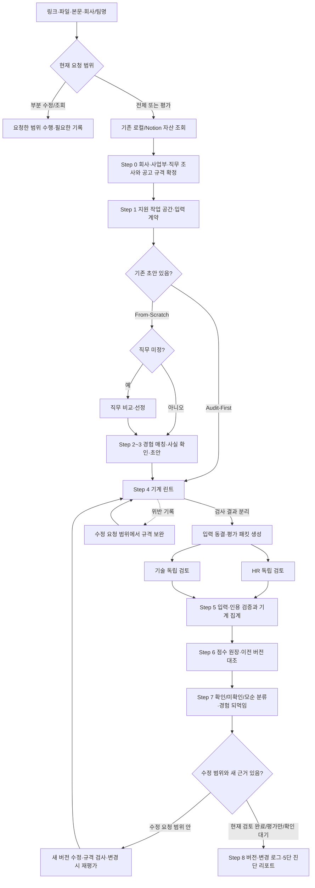

# JasoForge — 자기소개서 완결형 파이프라인 v5.0

공고와 지원자의 경험을 이해하고, 질문에 답하는 원고를 작성·평가·개선한 뒤 다음 지원에 쓸 기록을 남긴다. 사용자가 링크·파일·본문으로 작업을 맡기면 에이전트가 필요한 자료와 도구를 연결해 끝까지 진행한다. 사용자가 spec.json이나 평가 JSON을 직접 준비하는 것을 기본 사용법으로 요구하지 않는다.

독립 HR·기술 검토와 기계 검증은 이 과정의 핵심이다. 작성 점수, 규격 검사, 선택적 근거 대조를 분리한다. 작성 점수는 설명의 품질을 요약하며 실제 합격률은 아니다. 근거 없는 합격권 표시·만점 복원·업종별 자동 탈락 규칙을 복구하지 않는다.

## 실행 범위와 진입

현재 요청과 기존 문맥을 먼저 읽고 범위를 정한다. 명확한 요청을 다시 확인받지 않는다.

| 요청 | 실행할 과정 | 종료 지점 |
| --- | --- | --- |
| ‘파이프라인 태워줘’, ‘전체 작성·검증해줘’, 스킬에 지원 작업을 맡김 | 아래 Step 0~8. 기존 초안이면 Audit-First, 없으면 From-Scratch | 원고·독립 평가·수정·기록·최종 브리핑 또는 필요한 사실 대기 |
| ‘이 자소서 평가/진단해줘’ | 대상·문항 확인 → 선행 조사 → 린트 → HR/TECH 독립 평가 → 점수 원장 → 상세 리포트 | 원본은 보존하고 구체적 보완점까지. 수정은 요청된 경우 수행 |
| ‘이 공고로 1번 써줘’ | 선행 조사·경험 확보 → 해당 문항 작성·규격/내용 검토 → 버전·변경 기록 | 요청한 문항. 전체 채점은 사용자가 전체 파이프라인도 요청한 경우 |
| ‘이 문장만 고쳐줘’, ‘윤문만’ | 확인된 사실과 문항에 맞춰 부분 수정 | 해당 범위. 조사·점수·전체 인터뷰로 확대하지 않음 |
| 공고/직무 분석만, 지원 상태 확인만 | 해당 조사·조회 | 분석 또는 상태 보고 |
| 스킬 자체 검증·수정 | 지침·코드·기능 보존 검증 | 기존 지원서·Notion을 자동 수정하지 않음 |

### 입력과 저장 모드

- URL·Notion 페이지·PDF/TXT/MD/DOCX·붙여넣은 본문·회사/팀명 호출을 받는다. 파일명·길이만으로 초안이라 확정하지 말고 내용을 읽어 공고·초안·경험·가이드를 분류한다. `scripts/smart_router.py`는 첫 입력의 힌트이며 본문 읽기를 대신하지 않는다.
- **Mode A — 로컬**: 제공 파일과 경험 원장을 사용한다. Notion 계정 없이도 동일한 작성·평가·기록을 수행한다. 파일 평가의 기본은 로컬 저장이다.
- **Mode B — Notion 연동**: 사용자가 링크·기존 Notion 자료 활용·연동을 요청하면 관련 기존 자산부터 조회한다. `--sync-notion`/`--notion` 또는 현재 세션의 명시적 동기화 요청에 따라 해당 지원서·조사·평가·경험·변경 로그를 반영한다. 조회 요청만으로 쓰기를 시작하지 않는다.
- `--local`은 Notion을 사용하지 않는 로컬 작업이다. 필요한 공개 공고·회사 조사는 할 수 있다. `--offline`은 모든 네트워크 조회를 하지 않는다. `--quick`은 제공 자료로 빠르게 검토하되 생략한 조사·독립 평가를 완료했다고 보고하지 않는다.
- **기존 자산 먼저**: 해당 모드의 경험 인덱스와 기존 지원서·조사 기록을 찾아 재사용한다. Notion은 [연동 계약](references/notion_schema.md)을 먼저 읽는다. 초안이 이미 있으면 다시 직무를 고르거나 처음부터 인터뷰하지 않는다. 경험 원장이 없는 첫 사용자도 정상적으로 작성·평가한다. 사용자의 설명을 출처가 있는 진술로 기록하고, 핵심 내용을 이해하는 데 필요한 사실만 질문한다. 증빙 수집을 선행 필수조건으로 만들지 않는다.
- 모호한 팀명은 공고·공식 검색으로 채용 법인과 고객사/담당 서비스를 구별한다. 해결되지 않은 법인·직무만 한 번에 질문한다. 본문에 등장한 협업 팀을 지원 조직으로 오인하지 않는다.

## 전체 흐름



이 과정은 **호스트 에이전트가 실행하는 파이프라인**이다. Python은 린트·패킷·검증·집계·점수 기록을 맡고, 에이전트는 조사·글쓰기·독립 평가자 호출·내용 판단·Notion 연동을 맡는다. `run_pipeline.py`가 패킷을 생성했다고 작업을 끝내지 않는다. 평가자 호출과 집계를 실제로 수행하고 [리포트 계약](references/diagnostic-report.md)까지 이어간다. 독립 실행 도구가 없으면 미실행 범위와 재개 자료를 남기며 자체 채점을 독립 평가로 위장하지 않는다.

## Step 0. 공고 수집·3계층 조사·직무 선택

[조사와 context 계약](references/research-context.md)을 읽고 현재 공고와 기존 조사 자료를 대조한다. 전체 작성·평가에서는 다음 세 층을 확인하고 출처·확인일·미확인을 기록한다.

1. **회사**: 채용 법인, 사업·고객·주요 제품, 공식 비전/가치, 최근 방향과 관련 산업 이슈.
2. **사업부/제품**: 담당 서비스·고객·운영 환경, 채용 법인과 고객사의 관계, 확인 가능한 현안.
3. **직무**: 담당업무 원문과 순서, 필수·우대 자격, 기술 스택, 신입/인턴 등 전형, 실제 업무에서 중요한 제약과 기술적 쟁점.

근무지·고용 형태·전형 일정표·복수지원 제한·어학 유효기간·필수 서류도 공고에서 확인해 지원 전 조건표로 남긴다. 적용되지 않는 조건과 미확인 조건을 구별한다.

관련 자료를 찾지 못한 항목은 미확인으로 남긴다. 문항 원문·직무 설명 부재로 평가가 불가능한 작성 축만 DEFERRED로 유보하고 해당 문항·종합 점수를 확정하지 않는다. 개인 경험 증빙의 부재는 유보 사유가 아니다. 조사할 항목이 있다는 이유로 회사 내부 아키텍처·장애·우선순위를 발명하지 않는다. 제공된 조사 원문이 충분하고 시점이 맞으면 재사용하며 무조건 웹을 다시 검색하지 않는다. 오프라인이면 제공 자료 범위를 밝힌다.

담당업무는 **공고 원문 순서를 보존하고 앞 항목부터 검토**한다. 명시된 중요도는 그대로 반영하고, 단순 나열의 중요도는 해석임을 표시한다. 순서만으로 아래 업무를 무관한 일로 만들거나 자동 감점하지 않는다. 필수와 우대를 바꾸지 않는다.

초안이나 확정 직무가 없을 때는 경험 아카이브 본문과 공고의 전 직무를 비교한다. 지원 자격·직접 접점·새로 익혀야 할 부분을 보고 1순위와 대안의 이유를 남긴다. 관심/작성자 수는 그 정의 그대로 기록하며 실제 지원자 수나 경쟁률로 바꾸지 않는다. 조회 불가를 0명으로 쓰지 않는다.

## Step 1. 지원 작업 공간과 입력 계약

[저장·되먹임 계약](references/workflow-storage.md)을 읽고 시즌·채용 법인·전형·직무가 구분되는 지원서키와 버전을 정한다. 기존 키가 있으면 재사용하고 다른 지원을 합치지 않는다.

- `context.json`: Step 0의 대상·조사 원문·출처, 선택적 경험 근거. 후속 작성과 HR/TECH에 같은 입력을 전달한다.
- `spec.json`: 실제 문항 원문·요구·최소/최대·글자/바이트 기준·블라인드 규정·적용 평가 축. 도구 입력은 에이전트가 만든다. 구형 spec은 [이전 절차](references/migration.md)에 따라 원본을 보존하고 부족한 문항·적용 축을 자료에서 보완한다.
- `draft_v1.txt` 등: 문항 구분자 `===1===`와 답변 본문. 현재 Python CLI는 draft.json을 직접 받지 않는다.
- `research.md`, `experience_vault.md`, `score_ledger.json`, `revision_log.json`: 조사, 경험, 평가, 수정 이력을 서로 구별한다.
- Notion에서는 현재 스키마를 조회해 지원 현황·버전 페이지·조사·경험·채점·변경 로그를 연결한다. 고정 DB ID나 새 DB 자동 생성에 의존하지 않는다.

## Step 2. 문항 요구와 경험 매칭

[문항별 작성 흐름](references/question-flows.md)을 읽고 실제 질문을 지원동기·역량·협업·가치관·성장과정·AI 활용·사회 이슈 등으로 분류한다. 회사명이 달라도 문항의 목적이 같으면 해당 방법을 적용한다. 복합 문항은 주된 흐름에 추가 요구를 연결한다.

문항마다 `유형 / 중심 답변 / 선택한 경험 / 연결할 사실 / 부족한 근거`를 짧게 정리한다. 예를 들어 협업은 상대의 필요를 이해하고 합의한 과정이 있는 소재를, 가치관은 이후 행동으로 이어진 원칙을 보여주는 소재를 고른다. 기술적으로 뛰어난 경험이라는 이유만으로 모든 문항에 우선 배치하지 않는다.

문항의 요구 사항과 후보 경험·근거·빠진 설명을 연결한다. 같은 사건이 여러 카드에 나뉘어 있으면 연결해서 본문을 읽는다. 제목·속성·벡터 검색 요약만으로 초안을 쓰지 않는다.

경험의 직무 성격, 본인 역할, 구현/조사 범위, 관찰된 결과와 가치관을 살핀다. 회사 업종·기술명 일치 수로 소재를 하드 필터링하거나 프로젝트 숫자로 점수를 정하지 않는다. 기술 외 활동도 질문에 맞으면 사용할 수 있다. 사회 이슈는 근거와 견해를 중심으로 구성한다.

## Step 3. 사실 확인과 초안 작성

사용자가 제공한 문체·편집 선호를 문항과 경험에 맞춰 반영한다.

Step 2에서 선택한 흐름을 출발점으로 개요를 만들고 자연스러운 문단으로 쓴다. 지원동기는 경험에서 생긴 관심이 회사·직무 선택과 계획으로 이어지게, 성장과정은 영향을 받은 경험이 후속 행동과 현재 태도로 이어지게 설명한다. 각 유형의 구체적인 방법과 보완 질문은 [공통 작성 기준](references/question-flows.md)을 따른다. 좋은 사례에서는 이 설명 연결을 배우고, 그 사람의 성과·정체성·표현을 복제하지 않는다.

경험 문항은 **S를 필요한 만큼 짧게, 본인의 T·A를 중심으로** 쓴다. 무엇이 어려웠고 왜 그 선택을 했는지 독자가 따라가게 설명한다. 판단의 이유·고민·원리 이해를 배경으로 오인해 자르지 않는다. 사용자 설명에서 결과의 범위를 구분해 연결하되 문단 순서·비율·문장 길이·두괄식·프로젝트 수를 고정하지 않는다. 지원동기·가치관·사회 이슈의 실제 요구를 같은 기술 극복담으로 바꾸지 않는다.

필요한 사실은 기존 기록과 본인 커밋부터 찾는다. 사용자 확인, 당시 코드·문서, 현재의 해석, 불확실한 기억을 구별한다. 실제 의문·감정·망설임은 보존하며 없는 실패·갈등·대안·수치·성과를 만들지 않는다. 논문 인용 수치와 본인 성과도 구별한다. 질문은 문항에 필요한 사실이 부족할 때만 한다.

기술 나열·장황한 소개·일반적인 포부를 실제 선택과 행동으로 다듬는다. 경험과 직무의 접점은 구체적으로 설명하되 단순한 개념 유사성을 동일 업무 경험으로 확대하지 않는다. 확정한 사용자 문장과 판단 연결을 보존하고 중복부터 덜어낸다. 제출문과 근거 메모를 분리한다. 필요하면 [문체 참고](references/advanced-options.md)를 읽는다.

## Step 4. 기계 린트와 내용 검사

```sh
python3 scripts/lint.py /path/to/draft_v1.txt /path/to/spec.json
```

실제 문항 ID, 공식 최소/최대, 바이트/글자 계수, 명시된 블라인드 금지사항을 검사한다. 실제 위반과 미확인 규격은 작성 점수와 분리한다. 평가 요청이면 원문을 보존한 채 내용 평가를 계속하고, 수정 요청 범위에서는 위반을 고친다. 임의 80% 하한·중간점 개수·첫 문단 비중·키워드 부재를 자동 탈락 사유로 만들지 않는다.

오탈자와 비문은 문맥에서도 확인한다. 단어 사전에 없다는 이유로 오류 없음을 보장하지 않는다. 린트 통과와 내용 충족은 별개다. 질문 이탈·본인 역할 불명확·근거 없는 확대를 사람이 읽듯 검토하되 이를 키워드만으로 확정하지 않는다.

## Step 5. HR·기술 독립 평가와 집계

전체 실행과 평가 요청에서는 [평가 실행 계약](references/evaluation.md)을 읽고 실제로 실행한다. 단순 문장 수정은 이 단계를 추가하지 않는다.

작성 점수는 A/B/C/D/E/F/H/I의 8개 축이다. 문항별 요구와 주장에 맞춰 적용/제외 이유를 평가 전에 정한다. HR는 A/E/F/I(설명·문항·태도), TECH는 B/C/D/H(판단·역할·직무·구체성)를 맡는다. 기존 G 규격은 기계 검사 상태로, J 근거 대조는 선택적 `fact_review`로 분리하며 합산하지 않는다. 상세 입력과 대조 범위는 [근거 대조 계약](references/fact-checking.md)을 따른다.

자료가 있으면 주요 주장과 실제 원문을 연결해 전달한다. 자료가 없는 경우와 호스트가 자료를 누락한 경우를 구별한다. 사용자 진술·제공 문서·코드·자소서 파생 기록의 종류를 보존하고, 자소서에서 옮긴 기록으로 사실 확인을 순환 증명하지 않는다. 자료 부재를 C 등 다른 축에서 우회 감점하지 않는다.

1. 입력을 동결하고 `run_pipeline.py`로 린트와 평가 패킷·세션 토큰을 생성한다.
2. **작성 대화를 상속하지 않는 독립 서브에이전트 HR와 TECH를 각각 호출**한다. Codex에서는 `fork_turns="none"`을 사용한다. 각자 본인 패킷만 읽으며 서로의 결과·목표 점수·과거 합불·작성자의 변론을 받지 않는다. 두 역할이 독립적이라는 것은 매번 호출 기록으로 확인한다.
3. 전형별 지침과 공통 문항별 작성 흐름이 패킷에 반영됐는지 확인하고 적용 축의 점수·정확한 인용·판단 이유·확인/수정 필요를 받는다. TECH는 문항별 면접 질문·의도·답변 범위·추가 확인 사실 또는 질문 생략 이유도 독립적으로 제출한다. 결함을 찾지 못했다는 이유만으로 만점을 주지 않는다.
4. 토큰·입력·문항·인용과 면접 질문 구조를 검증하고 Python으로 집계한다. 문항별 HR/TECH·가중 지수와 역할 평균은 `--out-json`으로 저장하며 호스트가 다시 계산하지 않는다. 잘못된 평가는 무효이며 만점 복원이 아니다. 기준·가중치는 실행 중 고득점에 맞춰 바꾸지 않는다.

HR는 문항에 필요한 설명의 연결과 태도의 행동 근거를, TECH는 선택 이유·결과·직무 접점을 같은 문항별 기준으로 검토한다. 항목을 모두 언급했어도 ‘관심→노력’, ‘상대의 필요→조율’, ‘가치관→현재 행동’ 등 핵심 관계가 본문에 없으면 구체적인 보완점을 남긴다. 작성자의 개요나 좋은 의도를 본문 충족으로 대신하지 않는다.

확인된 필수 자격 부족, 문항 핵심 누락, 기록과의 모순 등 중요한 문제는 총점 앞에 드러낸다. 높은 평균으로 묻지 않되, 업종이나 말투만으로 실제 채용 결격을 확정하지 않는다. `REVIEW_COMPLETE`, `REVISION_REQUIRED`, `INPUT_INCOMPLETE`, `NOT_EVALUABLE`는 작성 평가 상태다. 규격은 MET/VIOLATION/UNVERIFIED, 사실 대조는 별도 coverage와 findings로 보고한다. 핵심 사실 충돌은 점수 앞에 표시하고 PROVISIONAL_FACT_CONFLICT로 해석을 제한한다. 작성 완료를 사실 검증·제출 승인으로 번역하지 않는다.

## Step 6. 점수 원장과 회귀 검토

유효한 독립 평가를 `record_review.py`로 `score_ledger.json`에 누적한다. 지원서키·평가 버전·run_id·문항·작성 점수·규격·근거 대조·입력 해시·평가자 실행 기록을 연결한다. [저장 계약](references/workflow-storage.md)의 명령과 예시를 따른다. 구형 원장을 조용히 덮어쓰거나 미검증 기록을 현재 점수로 가져오지 않는다.

수정 전후에서 질문 충족·사실 범위·핵심 판단의 설명을 대조한다. 동일 조건일 때 축별 점수 변화를 참고하되 점수 하락만으로 원문을 복원하지 않는다. 해시가 바뀐 원고는 새 평가가 필요하고, 같은 평가를 재사용하면 원래 실행임을 밝힌다.

## Step 7. 사실의 세 가지 상태와 경험 되먹임

주장별로 **자료 범위에서 일치 / 미확인 / 기록과 불일치**을 구분한다. ‘삼진 판정’은 세 상태의 구분이며 세 번 재작성하라는 규칙이 아니다. 대조 자료가 없으면 NOT_PROVIDED로 두고 사용자 진술을 전제로 진행한다. 미확인을 거짓·감점·소재 탈락으로 취급하지 않는다. 근거가 있을 때만 대조하고, 작은 수치 정정과 핵심 역할·성과의 충돌을 구별한다.

기존 자료에서 사실을 먼저 찾고, 필요한 질문의 답으로 새로 확인된 판단·행동은 출처·확인 주체와 함께 경험에 추가한다. 기존 사실을 수정된 자소서로 덮어쓰지 않는다. AI가 복원한 해석은 잠정 기록으로 두고 사용자 확인 없이 확정 진술로 승격하지 않는다. 사용자 확인도 독립된 문서·코드 검증과 구별한다. 로컬에서는 experience_vault.md, 연동 모드에서는 해당 경험 본문과 변경 로그에 연결한다.

전체 수정 요청이면 확인된 보완점으로 다음 버전을 작성하고 Step 4~6을 다시 수행한다. 점수 90·전축 5를 얻기 위한 반복은 하지 않는다. 필요한 사실이 없으면 확인 질문과 현재 가능한 원고를 남긴다. 새 근거·개선 이유가 없으면 반복을 끝낸다.

## Step 8. 지원서 확정·변경 로그·진단 리포트

원고의 큰 수정은 v1/v2로 분리하고 로컬 `revision_log.json`에 작성자·세션 ID·유형·Scope·대상 버전 하나·What/Why/Before/After와 원고 해시를 남긴다. Notion은 한 버전 한 페이지, 수정 세션 한 변경 로그, 본문 기준 면접 준비를 유지한다. 실제 제출본과 활성 초안을 구별하고 평가 완료만으로 제출 상태를 바꾸지 않는다.

[5단 진단 리포트](references/diagnostic-report.md)로 **종합 판단 → 규격 검사 → 문항별 HR/TECH 근거 → 면접 확인 질문 → 보완·다음 행동과 기록 위치**를 보고한다. 숫자는 실제 집계와 일치시킨다. 면접 항목은 독립 TECH의 질문과 생략 이유를 사용하고, 호스트가 추가한 질문은 별도로 표시한다. 채용 법인·담당 서비스가 다른 경우 근거에 따른 조직 관계 안내를 포함한다. 면접 답변은 확인된 과거 행동과 가능한 후속 해결책을 구별하고, 없는 구현을 본인이 했다는 답변으로 쓰지 않는다.

실제 합불 분석은 [결과 분석 원칙](references/outcome-review.md)을 따른다. 스킬 변경은 [변경·기능 보존 지침](GUIDELINES.md)을 적용한다. 코드 테스트뿐 아니라 입력부터 조사·평가·기록·리포트까지 필요한 기능이 계속 이어지는지 확인한다.
