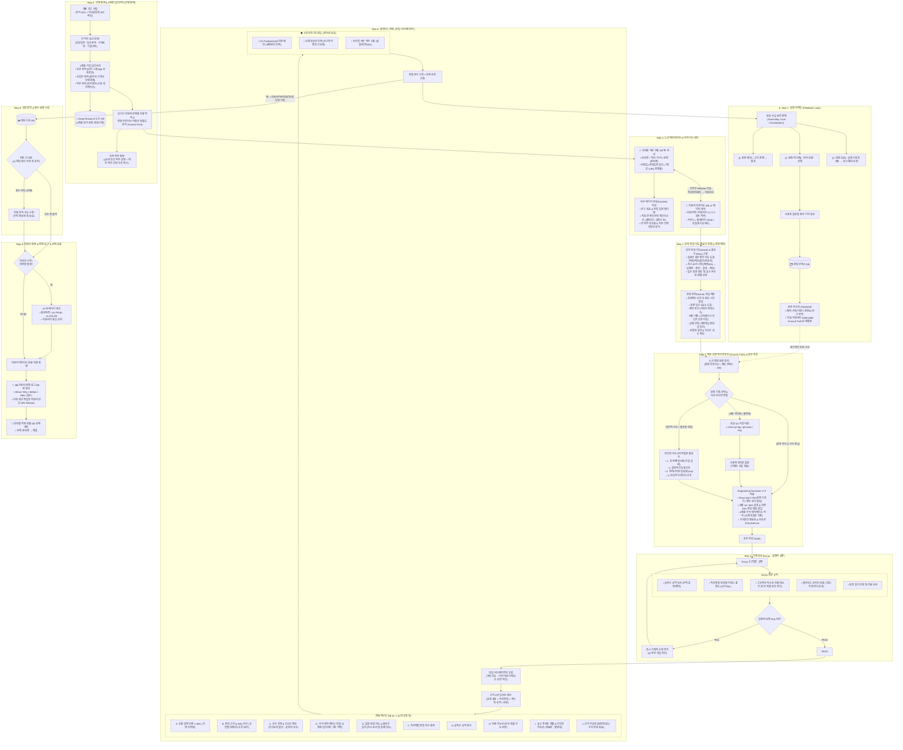

# 🏢 자소서 완결형 E2E 파이프라인 규격서 (jaso-pipeline)

이 스킬은 사용자가 채용 공고를 분석하고, 최적 직무를 매칭하며, 노션 DB와 연동하여 자기소개서를 작성·검증·자산화하는 전체 사이클을 관장합니다.

---

## 🗺️ 전체 아키텍처 다이어그램 (E2E Architecture)



---

## 📋 단계별 누락 방지 상세 실행 스펙

### [Step 0] 공고 수집 & 3계층 기업 딥리서치 (선행 탐색)

1. **공고 수집 및 전 직무 스크랩**:
   - 공식 채용 ATS 및 자소설닷컴 API를 파싱하여 기본 메타데이터(일정, 근무지, 고용 형태)를 확보.
   - 공고 내 오픈된 모든 직무의 **담당 업무, 필수 자격 요건, 우대 사항, 기술 스택**을 누락 없이 파싱하여 정리.

2. **3계층 기업 딥리서치 (3-Tier Deep Research)**:
   단순한 회사 소개나 비전 암기를 넘어, 아래의 3계층으로 구조화하여 조사 및 분석:
   - **① 기업 전사 영역 (Company Level)**: 비전, 핵심 비즈니스 모델(BM), 시장 포지션 및 경쟁 구도, 최근 투자/재무/신사업 방향성.
   - **② 해당 사업부/제품 영역 (Business Unit / Product Level)**: 지원 부서가 담당하는 핵심 제품·솔루션(예: 자체 프레임워크, 코어뱅킹 패키지, 대외계 통합 등), 타깃 고객군(글로벌 은행, 대기업 등) 및 고객사별 특화 환경, 사업부의 현재 당면 과제.
   - **③ 해당 직무/엔지니어링 영역 (Job / Engineering Level)**: 실제 시스템 아키텍처, 기술 스택, 배포 및 운영 규약, 현업이 맞닥뜨리는 **구체적인 기술적 엣지 케이스**(대외계 인터페이스 데이터 규약 불일치, 대량 트랜잭션 DB 왕복 병목, 실시간 동기화 오차 등).
   - **노션 `🧪 Deep Research 노트 DB` (`31af58c3-261e-8168-a214-d671dec11d62`) 연동**: 수집된 3계층 딥리서치 내용을 기업별 페이지로 영구 아카이빙하여 Ground Truth로 활용.

3. **실시간 지원자/경쟁률 파악**:
   - 자소설닷컴 API 실시간 지원자 수를 확인하여 직무별 경쟁 강도를 파악.

4. **경험 아카이브 기반 역발상 정합도 분석 (Archive-First)**:
   - *직무를 정해두고 내 경험을 억지로 끼워 맞추는 것이 아니라, 내 경험 아카이브(Ground Truth)를 바탕으로 최적 직무와 우대사항을 탐색함.*
   - 지원자의 경험 아카이브(FSD, TS/React, Java/Spring, iOS/Android Pinning, JNI 등)와 직무별 우대사항의 **문자 그대로의 직격도(Direct Hit)**를 계산.
   - 공고의 직무 역량과 우대 사항은 현업/인사팀의 깊은 고민이 담긴 최대의 힌트이므로, 3계층 딥리서치에서 도출된 당면 과제 관점에서 분석.
   - *타 사 지원서에서 썼던 소재라도 회사 간 중복 제출이 아니므로 무조건 배제하지 않고 정합성 최우선으로 매칭.*

5. **최적 직무 확정**:
   - 우대사항 직격도가 가장 높은 직무를 1순위로 확정하고, 경쟁률을 고려한 2순위 대안 직무의 선정 사유를 기록.

---

### [Step 1] 노션 메타데이터 세팅 & 양방향 Relation

1. **`🏢 회사별 지원 현황 DB` (`975d0820-971e-4335-ab6c-3aa08068b789`)**:
   - 속성: `회사`(Title), `직무`(Text), `부서`(Text), `상태`(`준비중`), `지원일`(**마감일자 필수 기입** — 누락 시 뷰에서 밀려남), `메모`(공고 URL, 마감시각, 경쟁률, 선정근거).
   - 본문: 공고 개요, 3계층 기업 딥리서치 요약(전사/사업부/직무), 지원 전 확인사항 체크리스트(블라인드, 최소/최대 글자수, 어학 유효기간 등), 전 직무 비교표, 직무 선정 타당성 분석.
2. **`📄 지원서 아카이브 DB` (`df7d2284-d7d4-4ed7-87c3-a002efca38c7`)**:
   - 속성: `지원서`(`{회사} {직무} 지원서 (v1)`), `지원서키`(`YYYY-회사-직무`), `버전`(`1`), `활성버전`(`TRUE`), `유형`(`자기소개서`), `작성일`.
3. **`🧪 Deep Research 노트 DB` (`31af58c3-261e-8168-a214-d671dec11d62`) 연동**:
   - 3계층 딥리서치 원장을 생성하고 회사 지원 현황과 상호 참조.
4. **양방향 Relation 연결**:
   - `회사별 지원 현황`의 `작성된지원서` ↔ `지원서 아카이브`의 `🏢 지원 회사`를 상호 연결.

---

### [Step 2] 문항 본질 의도·플로우 분해 & 장면 매칭

#### 1. 문항 본질 의도(Intent) & 질문 순서·논리 플로우(Flow) 고정
- **문항 원문 고정**: 문항 원문을 임의로 요약하거나 변형하지 않고 원문 그대로 고정.
- **질문의 본질적 의도(Intent) 규명**: 질문이 겉으로 묻는 표현 이면에 숨겨진 본질적 평가 기준을 정의.
  - *직무 역량/문제 해결 문항*: 단순 기술 스택 목록이 아니라 **"어떤 판단 과정과 근거로 문제를 해결했는가? 그 해결책이 사업부/직무의 엣지 케이스와 어떻게 연결되는가?"**
  - *협업/위기 극복 문항*: TMI 배경 나열이 아니라 **"프로젝트가 흔들린 난관에서 양자택일 딜레마 속 무엇을 우선순위로 두고 팀과 합의했는가? 단순 구현으로 끝내지 않고 잠재 리스크를 어떻게 끝까지 책임지고 완수했는가?"**
  - *가치관/최적 지원자 문항*: 추상적 인성(성실, 소통) 수식어가 아니라 **"행동화된 엔지니어링 원칙이며, 과거 1회성 깨달음이 아니라 현재도 유효한 업무 행동의 지속성(Persistence)을 지니고 있는가?"**
- **질문 지시 순서 및 논리 플로우(Flow) 강제**:
  - 질문 지시문이 요구한 전개 순서(예: 배경/상황 20% ➔ 난관/딜레마 ➔ 판단/조치 ➔ 결과물 ➔ 노력 ➔ 리스크 완수/적용)와 논리적 인과관계를 문단 전개에서 엄격히 유지.
  - 두괄식 결론 제시 후 지시 순서대로 논리적 인과관계를 완성하여 '질문과 답변의 1:1 호응 관계'를 시스템적으로 강제.
- **최소/최대 글자수(공백 포함 및 공백 제외) 규격 명시.**
- **지시문 내 필수 포함 항목을 개별 판정 태그로 분해** (`배경`, `행동`, `결과물`, `노력`, `합의`, `영향` 등).
- **요구 추상화 레벨 지정**: `습관` < `태도` < `원칙` < `가치관`. 문항이 요구한 레벨에 서술 층위를 맞춤.

#### 2. 장면 발굴 및 매칭 원칙
- **소재 선정 기준의 전환**: 가장 화려하고 어려운 기술을 찾는 것이 아니라, **프로젝트에서 가장 흔들렸던 난관과 힘든 시간 속에서 어떤 시각으로 선택을 내렸는가**를 핵심 장면으로 발굴.
- **장면 필수 요소 표 (문항 유형별 작성)**:
  지원서 초안 작성 전, 반드시 아래의 **장면 분석 표**를 채워야 함:

```markdown
| 문항 | 경험ID | ① 제약 / 문제 상황 | ② 기술적 판단 근거 (Why / 원리 / 대안) | ③ 실제 조치 (선택과 행동) | ④ 관찰된 결과 & 리스크 책임 (상태 변화 / 완수) |
| --- | --- | --- | --- | --- | --- |
| 문항 1 | ... | ... | ... | ... | ... |
```
*(※ ②열은 의사결정형 소재일 때는 '버린 대안과 이유', 디버깅형 소재일 때는 '원리 기반 원인 좁히기 근거', 가치관형 소재일 때는 '타협하지 않은 기준'으로 작성)*

---

### [Step 3] 팩트 검증 파이프라인 (Ground Truth) & 초안 작성

1. **노션 경험 원장 조회**: `경험 인덱스 DB`에서 기록된 사실과 맥락 확인.
2. **'미확인' 및 비선형적 서사의 대화적 복원 (4대 심층 역질문 플로우)**:
   - 원장의 `확인되지 않음`이나 `미확인`은 배제 금지가 아니라 **'아직 질문하지 않음(To-be-verified)'** 상태임.
   - 로컬 Git 커밋(`~/Dev/` git log/show)을 대조하거나 사용자에게 직접 질문하여 당시 판단 근거 복원.
   - **비선형적 서사 복원**: 원장과 커밋에는 보통 **정형화된 최종 결과(Problem ➔ Solution ➔ Result)**만 남아있어, 실제 개발자가 겪은 **비선형적 서사(첫 번째 삽질, 터닝포인트, 바닥까지 파고든 오기, 딜레마)**가 누락되어 있을 확률이 높음.
   - 글이 단선적인 조립식 블록처럼 굳어지는 것을 막기 위해, 작성 전 AI는 필요시 아래 **4대 심층 역질문**을 통해 사용자의 생생한 기억을 복원함:
     1. *(첫 번째 헛스윙)*: "처음에 원인이라고 짚었던 첫 번째 가설은 무엇이었고, 왜 빗나갔나요?"
     2. *(결정적 터닝포인트)*: "도저히 안 풀려서 막막했을 때, 시선을 바꾸게 된 계기(사소한 로그 한 줄, 낯선 문서 챕터 등)는 무엇이었나요?"
     3. *(엔지니어링 집요함/Grit)*: "남들은 '이 정도면 대충 돌아가니까 넘어가자'고 했을 텐데, 굳이 밑바닥 레이어(바이트코드, C++ 헤더, RFC 명세 등)까지 파고든 계기나 오기는 무엇이었나요?"
     4. *(현실적 트레이드오프)*: "그 해결책을 적용할 때 팀원이나 프로젝트 일정상 감수해야 했던 현실적인 비용(시간, 리소스, 편의성)이나 타협점은 없었나요?"
3. **Engineering Narrative v7.0 핵심 작성 5대 원칙 (컨설팅 메모 반영)**:
   - **상황 설명 극소화 (지면 최적화 전략 / 20~30% Rule)**: 맥락 삭제가 아닌, 프로젝트 인트로(서비스 소개, 팀원 수, 일반 기능 나열 등)로 글자수를 낭비하지 말라는 뜻. "무엇이 왜 문제였는가"라는 핵심 트리거만 1~2문장(20~30%)으로 빠르게 던지고, 지면의 70~80%는 평가자가 진짜 보고 싶어 하는 **'판단 근거, 대처 행동, 완수 책임'**에 집중 투자함.
   - **Show, Don't Tell (감정은 드라이하게, 집요함은 팩트의 깊이로)**: "뜨거운 열정과 책임감으로 밤을 새우며..." 같은 공허하고 장황한 형용사는 전면 금지. 대신 **'파고든 기술 레이어의 깊이(Depth of Action)', '읽은 공식 명세서 챕터', '확인한 바이트코드/패킷/로그 단위'**라는 구체적 팩트로 엔지니어링 집요함(Grit)을 증명.
   - **기술 스택 나열 지양 & 판단 과정 중심**: 무엇을 개발했는가가 아니라, 어떤 판단 근거로 어떤 조치를 취했고 어떤 결과를 도출했는가 중심으로 서술.
   - **양자택일 딜레마와 완수 책임**: "기능 확장 vs 안정화"처럼 상충하는 가치에서 무엇을 우선순위로 두고 팀과 합의했는지 서술하고, 단순히 코드를 작성하고 끝내는 것이 아니라 **"발생 가능한 잠재 리스크까지 확인하고 끝까지 책임지는 태도"**로 마무리.
   - **지원 부서 고유 업무의 '엣지 케이스' 직격 & 소재의 독립성 인정**: 
     - 3계층 딥리서치로 도출된 지원 부서가 실제로 다루고 있는 구체적인 기술적 문제(대외계 규약 불일치, DB 왕복 병목 등)와 내 문제 해결 경험을 1:1로 결합.
     - *단, 지원 부서 업무와 1:1로 억지 결합되지 않는 독창적 소재라도 문제를 정의하고 바닥까지 파고든 사고방식(Thinking Process) 자체가 뛰어나다면 억지로 부서 솔루션 이름을 붙이지 않아도 그 자체로 높게 평가함.*
   - **가치관의 행동화 및 지속성(Persistence)**: 가치관 문항에서 추상어(성실, 책임, 소통 등)를 배제하고 구체적인 업무 행동과 시스템으로 서술. 일회성 깨달음으로 끝내지 않고 **"그 깨달음이 현재도 지속되어 나의 일하는 원칙이 되었고 지원 회사 업무와 어떻게 이어지는가"**를 증명.
   - **담담한 브리핑 톤 & 무결성**: 동료 개발자에게 작업 내역을 브리핑하듯 담담하게 서술. 억지 교훈/마케팅 수식어 전면 배제. 측정하지 않은 가짜 수치(예: 0MB 등)를 절대 쓰지 않고, 관찰된 실제 상태 변화(종료 현상 해결, 빌드 통과 등)만 정직하게 서술.

---

### [Step 4] 기계 검사 (`lint.py` - 결정적 검증)

AI의 주관을 배제하고 파이썬 스크립트로 엄격 판정 (FAIL 시 즉시 수정 루프):
```bash
python3 ~/.gemini/config/skills/jaso-pipeline/scripts/lint.py <draft.txt> <spec.json>
```

> **입력 파일 규격**:
> - `<draft.txt>`: 각 문항을 `===1===`, `===2===`, `===3===` 구분자로 분리한 텍스트 파일
> - `<spec.json>`: `references/spec_example.json` 규격 (글자수 범위, 필수 키워드, 금지어, 고유명사 목록)

**검증 5대 규칙**:
1. **글자수 검사**: 공백 포함 및 공백 제외 양쪽 엄격 범위 체크.
2. **작성방법 항목별 키워드 충족도**: 필수 항목별 키워드 출현 횟수가 `0건`이면 필수 항목 누락으로 즉시 FAIL.
3. **고유명사 마스킹 치환 테스트**: 회사명/제품명을 `[회사]`로 마스킹했을 때 타사에 복사 붙여넣기 해도 통하는 일반론 문단이면 `WARN` 경고.
4. **블라인드 금지어 검출**: 대학교, 학과, 교수명, 연구실, 랩실 등 익명화 위반 패턴 필터링.
5. **문장 길이 분포 및 리듬 검사**: 짧은 문장과 긴 문장의 완급 조절 및 첫 문단(배경) 비중 30% 이하 여부 검사.

---

### [Step 5] 독립 서브에이전트 블라인드 채점

초안 작성 컨텍스트와 완전히 격리된 독립 서브에이전트를 호출하여 평가:
- **입력 4개만 제공**: `[1. 문항 원문 / 2. 작성방법 / 3. 채점 루브릭 / 4. 지원서 본문]`

#### 📊 채점 루브릭 DB (A~J 10개 공통 축 감점 기준표)
| 축 | 평가 항목 | 구체적 감점 기준 |
| :--- | :--- | :--- |
| **A** | 상황 설명 비중 | 첫 문단/배경 설명이 전체 분량의 20~30%를 초과하거나 나열식 기능 설명이 장황할 경우 감점 |
| **B** | 판단 근거 & Why 의식 | 맹목적 적용이 아닌 합리적 판단 이유(Why) 결여 시 감점.<br>• **선택/의사결정형**: 제약 ➔ 실제 선택 ➔ 버린 대안(트레이드오프) 3요소 필수.<br>• **원인규명/디버깅형**: 원리 기반 원인 좁히기 및 해당 방식을 택한 명확한 기술적 이유(Why) 제시 시 충족.<br>• **가치관/태도형**: 버린 대안 대신 '타협하지 않은 엔지니어링 기준' 제시 시 충족. |
| **C** | 완수 과정 & 리스크 책임 | 우선순위 충돌 시 합의 과정, 그리고 기능 구현 후 발생 가능한 잠재 리스크를 확인하고 끝까지 책임지는 구체적 행동이 없으면 감점 |
| **D** | 부서 엣지 케이스 연결 | 단순 포부가 아닌 3계층 딥리서치 기반 지원 부서/솔루션의 고유 기능이나 실제 당면한 엣지 케이스 수준으로 구체적이지 않으면 감점 *(단, 소재의 독립성 원칙에 부합할 경우 고득점 인정)* |
| **E** | 질문 본질 의도 & 플로우 일치 | 질문이 묻는 본질적 평가 의도(판단력/합의책임/지속성)를 관통하지 못하거나, 지시문의 서술 순서·논리 플로우를 이탈하면 감점 |
| **F** | 작성방법 전수 충족 | 문항 지시문에서 요구한 항목(행동, 결과물, 노력, 합의, 영향 등) 중 하나라도 빠지면 감점 |
| **G** | 글자수 규격 준수 | 지정된 글자수 범위(최소~최대)를 1자라도 벗어나면 감점 |
| **H** | 치환 가능성 | 고유명사를 뺐을 때 타사/타직무 어디에나 통하는 일반론 문장이 존재하면 감점 *(단, 보편적 CS Fundamental 서술은 제외)* |
| **I** | 요구 추상화 레벨 & 지속성 | 문항이 요구한 층위(습관/태도/원칙/가치관)와 어긋나거나, 추상어를 사용하거나, 일회성 깨달음에 그치고 현재 업무 행동으로의 지속성이 결여되면 감점 |
| **J** | 근거 무결성 | 원장에 없는 과장된 수치, 지어낸 주장, 가짜 팩트가 발견되면 즉시 탈락(FAIL) |

#### 🛡️ 채점 루브릭 운용 3대 가이드라인 (창의성 거세 방지 가드레일)
1. **[CS Fundamental의 치환 예외 (H축)]**:
   - 지원동기/포부에서 회사명만 바꾸면 어디에나 통하는 영혼 없는 미사여구는 엄격 감점 대상임.
   - 단, **보편적 CS Fundamental(JVM 메모리 구조, 동시성 제어, DB 인덱스 등)**은 그 원리를 특수한 제약 상황에서 왜 선택했고 어떤 구체적 조치를 취했는지(My Choice & Action)가 담겨있다면 치환 감점 대상에서 명백히 제외함.
2. **[소재의 독립성 인정 (D축)]**:
   - 지원 부서 업무와 1:1로 직접 닿지 않는 독창적 도메인(영상처리, ML 경량화 등)이라도, **문제를 정의하고 끝까지 파고든 엔지니어링 사고방식(Thinking Process)** 자체가 뛰어난 경우 억지 결합이 없어도 고득점을 부여함.
3. **[비선형적 서사의 적극 수용 (B축, C축)]**:
   - 단선적인 `제약 ➔ Why ➔ 선택 ➔ 결과`의 조립식 전개뿐만 아니라, **처절한 시행착오(삽질기), 반전의 계기, 우연한 발견을 끝까지 물고 늘어진 과정**도 창의적 문제 해결로 높게 평가함.

---

### [Step 6] 회귀 방지 & 점수 원장 기록
- `📊 채점 기록 DB`에 `(지원서키, 버전, 문항, 축)` 단위로 점수 및 감점 사유를 영구 보존.
- v2를 작성했을 때, v1 대비 점수가 하락한 축(퇴행)을 즉시 감지하여 한 쪽을 고치다 다른 쪽이 무너지는 **'진동 현상'을 시스템적으로 방지**.

---

### [Step 7] 원장 되먹임 (Flywheel Feedback Loop)

1. **삼진 판정 (Three-Way Truth Classification)**:
   - `[1. 원장 확인]`: 노션 원장 또는 Git 커밋에 명확한 근거 존재 → 본문 유지.
   - `[2. 원장 미기재]`: '아직 모름' 상태. **절대 AI 임의로 거짓말로 단정하여 삭제하지 말 것.** 사용자에게 질문하여 당시의 기억과 판단 근거를 복원함.
   - `[3. 원장 모순]`: 실제 기록과 상충되는 허위 서술 → 즉시 수정/삭제.
2. **경험 인덱스 DB 영구 갱신**:
   - 복원된 사실을 노션 `경험 인덱스 DB`의 `제약`, `버린 대안`, `장면ID` 및 본문 새 절로 즉시 반영하여 자산화.
3. **지식 축적 플라이휠**:
   - 지원서를 작성할 때마다 경험 원장이 자동으로 살찌며, 다음 지원서 작성의 견고한 Ground Truth로 순환.

---

### [Step 8] 지원서 확정 & 변경 로그 & 상태 완료
1. **버전 분리**: 대규모 수정 시 기존 페이지를 덮어쓰지 않고 v2 페이지를 새로 생성함 (v2 활성=TRUE, v1 활성=FALSE).
2. **`📝 ✍️ 지원서 변경 로그 DB` (`21a367de-0906-49f2-b93c-66aedc09a923`) 기록**:
   - 이번 세션에서 수정한 지원서 아카이브 단일 URL을 Relation으로 연결.
   - 필수 속성: `What`, `Why`, `Before`, `After`(핵심 변경 문장/전문 대조 필수 누락 금지).
3. **회사 지원 현황 상태 전이**:
   - `🏢 회사별 지원 현황 DB`의 상태를 `준비중`에서 `제출`로 갱신하여 전체 사이클을 완결.
